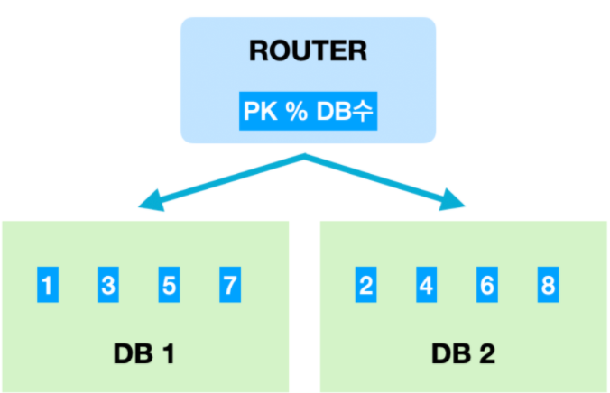
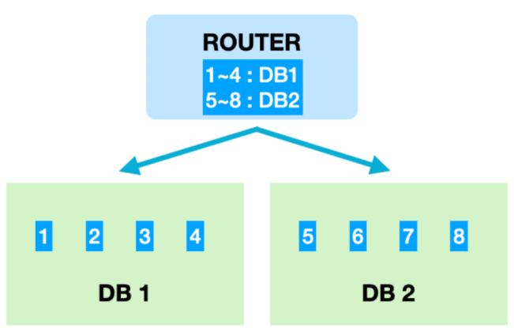

# 목차

1. 키(Key) 정리
2. SQL - JOIN  hash join, merge join
3. SQL Injection
4. SQL vs NoSQL
5. 정규화(Nomalization)
6. 이상(Anomaly)
7. **인덱스(INDEX)**
8. **트랜잭션(Transaction)**
9. **트랜잭션 격리 수준(Transaction Isolation Level)**
10. **레디스(Redis)**
11. **데이터베이스 제약조건**
12. **샤딩의 종류 -  module, range 차이**

-----------

# **인덱스(INDEX)**

* 추가적인 쓰기 작업과 저장 공간을 활용하여 데이터베이스 테이블의 검색 속도를 향상시키기 위한 자료구조

* 데이터베이스의 index는 책의 색인과 같다.

  데이터베이스에서도 테이블의 모든 데이터를 검색하면 시간이 오래 걸리기 때문에 데이터와 데이터의 위치를 포함한 자료구조를 생성하여 빠르게 조회할 수 있도록 돕고 있다.

**장점**

- 테이블을 조회하는 속도와 그에 따른 성능을 향상시킬 수 있다.
- 전반적인 시스템의 부하를 줄일 수 있다.

**단점**

- 인덱스를 관리하기 위해 DB의 약 10%에 해당하는 저장공간이 필요하다.
- 인덱스를 관리하기 위해 추가 작업이 필요하다.
- 인덱스를 잘못 사용할 경우 오히려 성능이 저하되는 역효과가 발생할 수 있다.

 만약 CREATE, DELETE, UPDATE가 빈번한 속성에 인덱스를 걸게 되면 인덱스의 크기가 비대해져서 성능이 오히려 저하되는 역효과가 발생할 수 있다. 그러한 이유 중 하나는 DELETE와 UPDATE 연산 때문이다. 앞에서 설명한대로, UPDATE와 DELETE는 기존의 인덱스를 삭제하지 않고 '사용하지 않음' 처리를 해준다고 하였다. 만약 어떤 테이블에 UPDATE와 DELETE가 빈번하게 발생된다면 실제 데이터는 10만건이지만 인덱스는 100만 건이 넘어가게 되어, SQL문 처리 시 비대해진 인덱스에 의해 오히려 성능이 떨어지게 될 것이다. 

**인덱스(index)를 사용하면 좋은 경우**

- 규모가 작지 않은 테이블
- INSERT, UPDATE, DELETE가 자주 발생하지 않는 컬럼
- JOIN이나 WHERE 또는 ORDER BY에 자주 사용되는 컬럼
- 데이터의 중복도가 낮은 컬럼

​	[참고자료](https://mangkyu.tistory.com/96)

# **트랜잭션(Transaction)**

- 트랜잭션이란 ? 
  - 데이터베이스 상태를 변화시키기 위해 수행하는 작업의 단위
- 트랜잭션의 특징
  - 원자성 : 트랜잭션은 DB에 모두 반영되거나, 반영되지 않아야 한다.
  - 일관성 : 트랜잭션의 작업결과는 항상 일관성이 있어야 한다
  - 독립성 : 둘 이상의 트랜잭션이 동시에 병행 실행되고 있을 때, 어떤 트랜잭션도 연산에 끼어들 수 없다.
  - 지속성 : 트랜잭션이 성공적으로 완료되면, 결과는 영구적으로 반영된다.

* 트랜잭션의 Commit, Rollback
  *  Commit이란 하나의 트랜잭션이 성공적으로 끝났고, 데이터베이스가 일관성있는 상태에 있을 때, 하나의 트랜잭션이 끝났다라는 것을 알려주기위해 사용하는 연산이다. 이 연산을 사용하면 수행했던 트랜잭션이 로그에 저장
  * Rollback이란 하나의 트랜잭션 처리가 비정상적으로 종료되어 트랜잭션의 원자성이 깨진경우, 트랜잭션을 처음부터 다시 시작하거나, 트랜잭션의 부분적으로만 연산된 결과를 다시 취소시킨다.

# **트랜잭션 격리 수준(Transaction Isolation Level)**

* 트랜잭션 격리수준(isolation level)이란 동시에 여러 트랜잭션이 처리될 때, **트랜잭션끼리 얼마나 서로 고립**되어 있는지를 나타내는 것이다.
* 즉, 간단하게 말해 특정 트랜잭션이 다른 트랜잭션에 변경한 데이터를 볼 수 있도록 허용할지 말지를 결정하는 것이다.
* 트랜잭션이 독립적인 수행을 하도록 Locking을 통해, 다른 트랜잭션이 관여하지 못하도록 막는 것이 필요하다.
* 하지만 무조건 Locking을 통해 동시에 수행되는 수많은 트랜잭션들을 순서대로 처리하면 데이터베이스 성능이 떨어진다. 하지만 locking의 범위를 줄인다면, 잘못처리될 가능성이 있다.
* 그래서 효율적인 locking이 필요하다.
  * lock : 트랜잭션 처리의 순차성을 보장하기 위한 방법
    * 공유 락 : 데이터를 읽을 때 사용되어지는 락, 동시 접근이 가능하다
    * 배타 락 : 데이터를 변경하고자 할때 사용, 트랜잭션이 완료될때까지 유지
      * lock이 해제될때까지 다른 트랜잭션(읽기포함)은 해당 리소스에 접근할 수 없다

> 격리수준

* 격리수준은 크게 아래의 4개로 나뉜다.

  * READ UNCOMMITTED

  - READ COMMITTED

  - REPEATABLE READ

  - SERIALIZABLE

* 아래로 내려갈수록 트랜잭션간 고립 정도가 높아지며, 성능이 떨어지는 것이 일반적이다.
  일반적인 온라인 서비스에서는 READ COMMITTED나 REPEATABLE READ 중 하나를 사용한다.
  (oracle = READ COMMITTED, mysql = REPEATABLE READ)

> READ UNCOMMITTED

* 어떤 트랜잭션의 변경내용이 COMMIT이나 ROLLBACK과 상관없이 다른 트랜잭션에서 보여진다.
* 예를 들어, A 트랜잭션에서 1번의 사원 나이를 변경하고 커밋하지 않았을 경우에도, B 트랜잭션에서 1번 사원의 나이를 조회하면 변경된 나이로 조회된다. 이것을 더티 리드라고 함.

> READ COMMITTED

* 어떤 트랜잭션의 변경 내용이 COMMIT 되어야만 다른 트랜잭션에서 조회할 수 있다. 오라클 DBMS에서 기본으로 사용하고 있고, 온라인 서비스에서 가장 많이 선택되는 격리수준이다.
* `NON-REPETABLE READ` 부정합 문제가 발생
  * B 트랜잭션이 10번 사원 나이를 조회 
  * A 트랜잭션이 10번 사원 나이를 변경하고 커밋
  * B 트랜잭션이 10번 사원 나이 다시 조회 -> 변경된 나이 조회
  * **하나의 트랜잭션내**에서 똑같은 SELECT를 수행했을 경우 **항상 같은 결과를 반환**해야 한다는 REPEATABLE READ 정합성에 어긋나는 것이다.
  * 예를 들어, 오늘의 입금 총 합을 보여주는 트랜잭션이 있다면, 총합을 계산하는 select 쿼리는 실행될 때 마다 다른 결과 값을 가져온다.

> REPEATABLE READ

* **트랜잭션이 시작되기 전에 커밋된 내용에 대해서만 조회할 수 있는 격리수준**이다. MySQL DBMS에서 기본으로 사용하고 있고, 이 격리수준에서는 NON-REPETABLE READ 부정합이 발생하지 않는다.
* 간단하게 말해서 **자신의 트랜잭션 번호보다 낮은 트랜잭션 번호에서 변경된(+커밋된) 것만 보게 되는 것이다.**
* REPEATABLE READ에서 발생하는 데이터 부정합
  * UPDATE 부정합
  * Phantom READ : 한 트랜잭션 안에서 레코드를 두번 읽었을 때, 첫번째 쿼리에서 없던 레코드가 두번째 쿼리에서 나타나는 현상

>  SERIALIZABLE

* 가장 단순하고 엄격한 격리 수준이다.
* 격리수준이 SERIALIZABLE일 경우 읽기 작업에도 `공유 잠금`을 설정하게 되고, 이러면 동시에 다른 트랜잭션에서 이 레코드를 변경하지 못하게 된다.
  이러한 특성 때문에 동시처리 능력이 다른 격리수준보다 떨어지고, 성능저하가 발생하게 된다.

​	[참고자료](https://joont92.github.io/db/트랜잭션-격리-수준-isolation-level/)

# **레디스(Redis)**

* REDIS(REmote Dictionary Server)는 메모리 기반의 “키-값” 구조 데이터 관리 시스템이며, 모든 데이터를 메모리에 저장하고 조회하기에 빠른 Read, Write 속도를 보장하는 **비 관계형 데이터베이스**이다.
* 레디스는 크게 5가지< String, Set, Sorted Set, Hash, List >의 데이터 형식을 지원한다.
* Redis는 빠른 오픈 소스 인 메모리 키-값 데이터 구조 스토어이며, 다양한 인 메모리 데이터 구조 집합을 제공하므로 사용자 정의 애플리케이션을 손쉽게 생성할 수 있다.

> 레디스 특징

* 영속성을 지원하는 인메모리 데이터 저장소.
* 읽기 성능 증대를 위한 서버 측 복제를 지원한다.
* 쓰기 성능 증대를 위한 클라이언트 측 **샤딩(Sharding)**을 지원한다.
* 문자열, 리스트, 해시, 셋, 정렬된 셋과 같은 다양한 데이터형을 지원한다.
* Redis Server는 1개의 싱글 쓰레드로 수행되며, 따라서 서버 하나에 여러개의 서버를 띄우는 것이 가능하다.

​	[참고자료](https://jyejye9201.medium.com/레디스-redis-란-무엇인가-2b7af75fa818)

# **데이터베이스 제약조건** 방법

* 읽어보기 : [참고자료](https://velog.io/@aad3365/관계형데이터베이스-제약조건)

# **샤딩의 종류 -  module, range 차이**

- 같은 테이블 스키마를 가진 데이터를 다수의 데이터베이스에 분산하여 저장하는 방법

- **Horizontal Partitioning**이라고 볼 수 있다.

- 샤딩을 적용한다는 것은 프로그래밍, 운영적인 복잡도가 높아질 수 있는 단점이 있다.

- 가능하면 샤딩을 피하거나 지연시킬 수 있는 방법을 찾아야 한다.

  - Scale in : 하드웨어 스펙이 더 좋은 컴퓨터 사용
  - Read 부하가 크다면, cache나 데이터베이스의 Replication 적용
  - 일부 컬럼만 자주 사용한다면, vertically partiion도 하나의 방법이다, 혹은 데이터를 Hot, Warm, Cold data로 분리

- 모듈러 샤딩과 레인지 샤딩의 공통 요구사항

  - 라우팅을 위해 구분할 수 있는 유일 키값이 있어야 한다. (PK 혹은 샤딩키)
  - 올바른 DB를 찾을 수 있도록 라우팅 되어야 한다.
  - 설정으로 쉽게 증설이 가능해야 한다.
  - 모듈러 샤딩과 레인지 샤팅은 장단점이 명확하며, 상호배타적인 성격을 가진 것처럼 보이기도 한다. 따라서 DB마다 데이터의 성질에 따른 방식을 선택해야 한다.

  

  **모듈러 샤딩**

  

  - PK를 모듈러 연산한 결과로 DB를 특정하는 방식

  - 장점 : 레인지 샤딩에 비해 데이터가 균일하게 분산된다.

  - 단점 : DB를 증설하는 과정에서 이미 적재된 데이터의 재정렬이 필요

  - 모듈러 샤딩은 데이터량이 일정 수준에서 유지될 것으로 예상되는 데이터 성격을 가진 곳에 적용해야 한다.

    - 서비스 오픈 시점에 콘텐츠 유지 기간이 24시간으로 제한되어 있는 경우, 데이터는 항상 쌓이는 상황이 아니기 때문에 모듈러 샤딩이 알맞음
    - 데이터가 꾸준히 늘어날 수 있는 경우라도, 적재 속도가 빠르지 않다면 모듈러 방식 고려 가능

  - 데이터가 **균일하게 분산된다는 점은 트래픽을 안정적으로 소화하면서 DB 리소스를 최대한 활용**할 수 있기 때문이다.

    

  

  **레인지 모듈**

  

  - PK 범위를 기준으로 DB를 특정하는 방식
  - 장점 : 모듈러 샤딩에 비해 증설에 대한 재정렬 비용이 들지 않는다.
  - 단점 : 일부 DB에 데이터가 몰릴 수 있다.
  - 데이터가 급격히 증가할 여지가 있다면 레인지 방식도 좋은 선택이다. 하지만 주로 활성 유저가 몰린 DB로 트래픽이나 데이터량이 몰릴 수 있다. 이런 상황이 발생하면 또 다시 부하 분산을 위해 해당 DB를 쪼개 재정렬하는 작업이 필요하고, 트래픽이 저조한 DB는 통합 작업을 통해 유지 비용을 아끼도록 관리 해야한다.

  참고 자료 : [Database의 샤딩(Sharding)이란? (nesoy.github.io)](https://nesoy.github.io/articles/2018-05/Database-Shard)

  참고 자료 : [DB분산처리를 위한 sharding | 우아한형제들 기술블로그 (woowahan.com)](https://techblog.woowahan.com/2687/)

