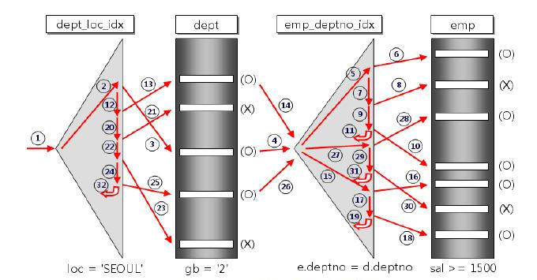
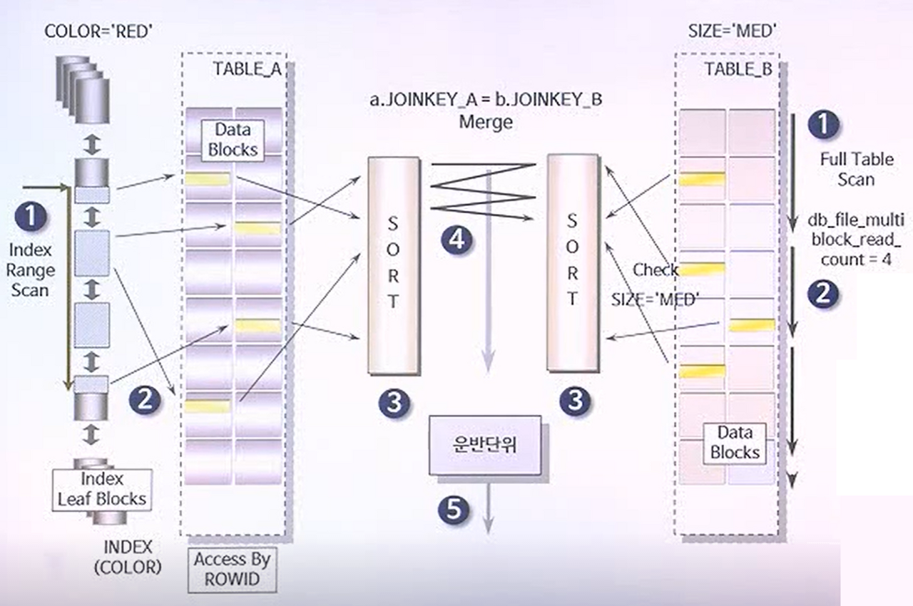
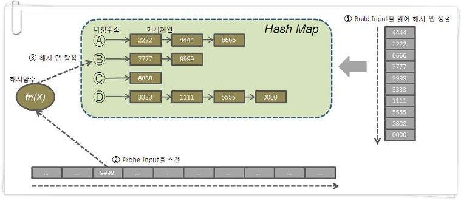

# 데이터베이스
## 키(Key) 정리

### 핵심

- 키간의 관계, 어떤 조건을 만족해야 어떤 키가 되는 걸까


> Key란? : 검색, 정렬시 Tuple을 구분할 수 있는 기준이 되는 속성(Attribute).

### 1. Candidate Key (후보키)

> Tuple을 유일하게 식별하기 위해 사용하는 속성들의 부분 집합. (기본키로 사용할 수 있는 속성들)

2가지 조건 만족

- 유일성 : Key로 하나의 Tuple을 유일하게 식별할 수 있음
- 최소성 : 꼭 필요한 속성으로만 구성


### 2. Primary Key (기본키)

> 후보키 중 선택한 Main Key

특징

- Null 값을 가질 수 없음
- 동일한 값이 중복될 수 없음


### 3. Alternate Key (대체키)

> 후보키 중 기본키를 제외한 나머지 키 = 보조키


### 4. Super Key (슈퍼키)

> 유일성은 만족하지만, 최소성은 만족하지 못하는 키


###  5. Foreign Key (외래키)

> 다른 릴레이션의 기본키를 그대로 참조하는 속성의 집합


## SQL - JOIN 

### 핵심

​	- 조인의 종류, 각 조인별 특징

#### 조인이란?

> 한 [데이터베이스](https://ko.wikipedia.org/wiki/데이터베이스) 내의 여러 [테이블](https://ko.wikipedia.org/wiki/테이블_(데이터베이스))의 레코드를 조합하여 하나의 열로 표현한 것

테이블을 연결하려면, 적어도 하나의 칼럼을 서로 공유하고 있어야 하므로 이를 이용하여 데이터 검색에 활용한다.

### 기본 조인

- INNER JOIN

- LEFT JOIN

- RIGHT JOIN

- LEFT OUTER JOIN

- RIGHT OUTER JOIN

- FULL OUTER JOIN


- CROSS JOIN : 두 테이블의 곱집합, 즉 모든 경우의 수를 전부 표현해주는 방식
- SELF JOIN(자가 조인): 하나의 테이블을 여러번 복사해서 조인


### 인덱스 관련 조인

#### NESTED LOOP JOIN

**정의**

> 줄여서 NL JOIN이라고도 불리는 NESTED LOOP JOIN은 2개 이상의 테이블에서 하나의 집합을 기준으로 순차적으로 상대방 Row를 결합하여 원하는 결과를 조합하는 조인 방식

#### Driving Table 과 Driven Table

Driving Table이란 JOIN을 할 때 먼저 액세스 되어 ACCESS PATH를 주도하는 테이블을 Driving Table이라고 합니다. 즉, **조인을 할때 먼저 액세스 되는 테이블을 Driving Table**이라고 하며 **나중에 액세스 되는 테이블을 Driven Table**이라고 합니다. 여기서 Driving Table은 옵티마이저가 결정하고 자연스레 Driving Table이 아닌 테이블은 Driven Table로 결정됩니다. 


> 학생 테이블과 학교 테이블로 예를 들면 이름이 홍길동인 학생의 학교 정보를 알고 싶다면 학생 테이블이 Driving Table이 되는 것이고 서울대학교의 학생들의 정보를 보고 싶다면 학교 테이블이 Driving Table이 되는 것입니다.


#### NESTED LOOPS JOIN의 장단점

**1.** 인덱스에 의한 랜덤 액세스에 기반하고 있기 때문에 대량의 데이터 처리 시 적합하지 않습니다.

**2.** Driving Table로는 데이터가 적거나 where절 조건으로 row의 숫자를 줄일 수 있는 테이블이어야 합니다.

**3.** Driven Table에는 조인을 위한 적절한 인덱스가 생성되어 있어야 합니다.

**4.** 선행 테이블의 결과를 통해 후행 테이블을 액세스 할 때 랜덤 I/O가 발생합니다.


#### NESTED LOOP JOIN의 동작 방식



```java
 for(i=0; i<dept.length; i++) { -- driving table 
    for(j=0; j<emp.length; j++) { -- driven table
       // Search
    } 
}
```

동작 순서를 보시면 아시겠지만 위와 같은 이중 for문과 작동원리는 비슷합니다.

위의 그림에서 먼저 액세스 된 dept Table이 Driving Table이고 나중에 액세스 된 emp Table이 Driven Table입니다. 위의 그림에서 볼 수 있듯이 dept의 데이터를 추출하기 위해 dept_loc_idx라는 인덱스를 사용하여 gb = '2'인 데이터를 추출하였으며, 이렇게 검색된 데이터를 가지고 같은 deptno를 가지는 사원들의 정보를 emp_deptno_idx라는 인덱스를 사용하여 sal >=1500 조건으로 emp Table을 조회하였습니다. 

이렇듯 NESTED LOOP JOIN의 동작 방식은 Driving Table의 처리 범위를 하나씩 액세스 하면서 추출된 값으로 Driven Table을 조인하는 방식으로 동작하게 됩니다.

#### SORT-MERGE JOIN 

> 조회의 범위가 많을 때 주로 사용하는 조인 방법론이며 양쪽 테이블을 각각 Access 하여 그 결과를 정렬하고 그 정렬한 결과를 차례로 Scan 해 나가면서 연결고리의 조건으로 Merge를 하는 방식. 조회의 범위가 좁을 때 유리한 Nested Loop Join의 조인 방식과 장단점이 서로 바뀌어있다고 생각하시면 이해하기 쉽습니다.

#### SORT MERGE JOIN의 사용처

**1.** 연결 고리에 인덱스가 전혀 없는 경우

**2.** 대용량의 자료를 조인할때 유리한 경우

**3.** 조인 조건으로 <, >, <=, >=와 같은 범위 비교 연산자가 사용된 경우

**4.** 인덱스 사용에 따른 랜덤 액세스의 오버헤드가 많은 경우

#### SORT MERGE JOIN의 동작 방식

```sql
select /**USER_MERGE(A B) */ A.Color, B.SIZE,...
from TABLE_A A,TABLE_B B
where a.joinkey_a = b.joinkey_b -- join key에 대한 인덱스가 테이블 둘 모두 다 없음
and a.color = 'RED' --인덱스 있음
and b.size = 'MED'; --인덱스 없음
```

위와 같은 쿼리에 color칼럼에만 인덱스가 있다고 가정하였을 때 SORT MERGE JOIN로 이 쿼리가 동작된다면 아래와 같은 프로세스로 동작하게 됩니다. 



위의 숫자에 있는 순서대로 1~5번대로 차례로 진행됩니다. 먼저 왼쪽과 오른쪽에 있는 TABLE_A와 TABLE_B를 동시에 ACCESS 합니다. 여기서 COLOR에 인덱스가 걸려있기에 TABLE_A는 인덱스 스캔을 할 것이고 TABLE_B는 테이블 풀스 캔을 하겠죠. 그리고 이렇게 조회된 데이터들은 TABLE_A에서 읽은 데이터는 JOINKEY_A를 기준으로, TABLE_B에서 읽은 데이터는 JOINKEY_B를 통해 별도의 공간에서 SORT 작업을 거치게 됩니다. 두 개의 정렬 작업이 모두 완료되었다면 정렬한 결과를 차례로 Scan 해 나가면서 연결고리의 조건으로 Merge 하여 리턴하게 됩니다. 

 

위에서 설명한 SORT MERGE JOIN의 동작 방식의 내용을 간단하게 다시 정리하자면 아래의 3단계로 이루어진다고 생각하시면 됩니다.

 

**1.** 각 테이블에 대해 동시에 독립적으로 데이터를 먼저 읽어 들인다.

**2.** 읽혀진 각 테이블의 데이터를 조인을 위한 연결고리에 대하여 정렬을 수행한다.

**3.** 정렬이 모두 끝난 후에 조인 작업이 수행한다.


#### HASH JOIN

> HASH 조인은 조인될 **두 테이블 중 하나를 해시 테이블로 선정**하여 **조인될 테이블의 조인 키 값을 해시 알고리즘으로 비교**하여 매치되는 결과값을 얻는 방식입니다. HASH JOIN은 **비용 기반 옵티마이저**를 사용할 때만 사용될 수 있는 조인 방식이며 **'=' 비교를 통한 조인**에서만 사용될 수 있습니다. 주로 많은 양의 데이터를 조인해야 하는 경우에 주로 사용됩니다.

### HASH JOIN의 사용처

**1.** JOIN 컬럼에 적당한 인덱스가 없어 NL JOIN이 비효율적일 때

**2.** JOIN Access량이 많아 Random Access 부하가 심하여 NL JOIN이 비효율적일 때

**3.** Sort Merge Join을 하기에는 두 테이블이 너무 커 Sort 부하가 심할 때

**4.** 수행빈도가 낮고 쿼리 수행 시간이 오래 걸리는 대용량 테이블을 JOIN 할 때


### HASH JOIN의 동작 방식



**1.** 둘 중 작은 집합(Build Input)을 읽어 Hash Area에 해시 테이블을 생성한다. (해시 함수에서 리턴 받은 버킷 주소로 찾아가 해시 체인에 엔트리를 연결)

**2.** 반대쪽 큰 집합(Probe Input)을 읽어 해시 테이블을 탐색하면서 JOIN 한다.

**3.** 해시 함수에서 리턴 받은 버킷 주소로 찾아가 해시 체인을 스캔하면서 데이터를 찾는다.

### 출처

https://coding-factory.tistory.com/756?category=990785

https://coding-factory.tistory.com/757?category=990785

https://coding-factory.tistory.com/758?category=990785

## SQL Injection

### 핵심

​	- 정의, 공격방법, 방어방법

> 해커에 의해 조작된 SQL 쿼리문이 데이터베이스에 그대로 전달되어 비정상적 명령을 실행시키는 공격 기법


### 공격 방법

#### 1) 인증 우회

보통 로그인을 할 때, 아이디와 비밀번호를 input 창에 입력하게 된다. 쉽게 이해하기 위해 가벼운 예를 들어보자. 아이디가 abc, 비밀번호가 만약 1234일 때 쿼리는 아래와 같은 방식으로 전송될 것이다.

```sql
SELECT * FROM USER WHERE ID = "abc" AND PASSWORD = "1234";
```

SQL Injection으로 공격할 때, input 창에 비밀번호를 입력함과 동시에 다른 쿼리문을 함께 입력하는 것이다.

```sql
1234; DELETE * USER FROM ID = "1";
```

보안이 완벽하지 않은 경우, 이처럼 비밀번호가 아이디와 일치해서 True가 되고 뒤에 작성한 DELETE 문도 데이터베이스에 영향을 줄 수도 있게 되는 치명적인 상황이다.

이 밖에도 기본 쿼리문의 WHERE 절에 OR문을 추가하여 `'1' = '1'`과 같은 true문을 작성하여 무조건 적용되도록 수정한 뒤 DB를 마음대로 조작할 수도 있다.


#### 2) 데이터 노출

시스템에서 발생하는 **에러 메시지를 이용**해 공격하는 방법이다. 보통 에러는 개발자가 버그를 수정하는 면에서 도움을 받을 수 있는 존재다. 해커들은 이를 역이용해 악의적인 구문을 삽입하여 에러를 유발시킨다.

즉 예를 들면, 해커는 **GET 방식으로 동작하는 URL 쿼리 스트링을 추가하여 에러를 발생**시킨다. 이에 해당하는 오류가 발생하면, 이를 통해 해당 웹앱의 데이터베이스 구조를 유추할 수 있고 해킹에 활용한다.

### 방어 방법

#### 1) input 값을 받을 때, 특수문자 여부 검사하기

> 로그인 전, 검증 로직을 추가하여 미리 설정한 특수문자들이 들어왔을 때 요청을 막아낸다.

#### 2) SQL 서버 오류 발생 시, 해당하는 에러 메시지 감추기

> view를 활용하여 원본 데이터베이스 테이블에는 접근 권한을 높인다. 일반 사용자는 view로만 접근하여 에러를 볼 수 없도록 만든다.

#### 3) preparestatement 사용하기(named parameter)

> **preparestatement**를 사용하면, **특수문자를 자동으로 escaping** 해준다. (statement와는 다르게 쿼리문에서 전달인자 값을 `?`로 받는 것) 이를 활용해 **서버 측에서 필터링** 과정을 통해서 공격을 방어한다.

## SQL vs NoSQL

### 핵심

​	- SQL의 특징 , NOSQL의 특징, 둘의 비교, 언제 어떤걸 쓸 까

### SQL (관계형 DB)

#### SQL 특징

SQL을 사용하면 RDBMS에서 데이터를 저장, 수정, 삭제 및 검색 할 수 있음

관계형 데이터베이스에는 핵심적인 두 가지 특징이 있다.

- 데이터는 **정해진 데이터 스키마에 따라 테이블에 저장**된다.

  데이터는 테이블에 레코드로 저장되는데, 각 테이블마다 명확하게 정의된 구조가 있다. 

  해당 구조는 필드의 이름과 데이터 유형으로 정의된다.

  따라서 **스키마를 준수하지 않은 레코드는 테이블에 추가할 수 없다.** 즉, 스키마를 수정하지 않는 이상은 정해진 구조에 맞는 레코드만 추가가 가능한 것이 관계형 데이터베이스의 특징 중 하나다.

- 데이터는 **관계를 통해 여러 테이블에 분산**된다.

​		또한, 데이터의 중복을 피하기 위해 '**관계**'를 이용한다.

​		하나의 테이블에서 중복 없이 하나의 데이터만을 관리하기 때문에 다른 테이블에서 부정확한 데		이터를 다룰 위험이 없어지는 장점이 있다.


### NoSQL

#### DEFINITION

NO SQL : NOT only SQL, SQL만을 사용하지 않는 DBMS

⇒ RDBS를 사용하지 않는다는 의미가 아니라 여려 유형의 DB를 함께 사용하는 것을 의미한다.

NO SQL은 하나의 대상을 지칭하는 것이 아니라, SQL이 아닌 데이터를 저장하는 모든 방법을 의미한다.

EX) Redis, Cassandra, HBase, MongoDB, Firebase

#### BACK GROUND

21세기 들어, 웹 2.0 환경과 빅데이터의 등장으로 데이터를 처리하는데 필요한 비용이 급격히 증가 하였음. 기존 RDBS는 분산 저장이 불가능하여, 더 많은 데이터를 저장하기 위해 SCALE-UP(저장소의 성능 향상)이 필요한데, 이에 대한 비용이 많이 발생하면서 SQL을 벗어난 저장방식의 필요성이 대두 되었다. NOSQL은 **RDBS의 일관성을 포기(TRADE-OFF)하고, 분산저장(SCALE-OUT)을 목표로 등장**하였다.


#### No SQL의 종류

No SQL은 앞서 설명 했듯이, SQL이 아닌 모든 데이터 저장방식을 일컫기 때문에 그 종류가 매우 많다. 대표적으로 자주 사용되는 No SQL인 집합 지향 모델(Document DB, Key-Value stores, Column-oriented DB 등), 그래프 모델(Graph DB)이 있다.


### No SQL의 장점

한줄 요약 : 유연한 데이터 모델, 수평적 스케일링(분산저장), 빠른 쿼리 지원, 직관적인 이해 가능(개발자들이 일할때 편함)

#### A. 유연한 스키마 모델.

: **유연한 스키마**이기 때문에 요구사항이 변동됨에 따라 생기는 변경점을 DB에 적용하기 쉽다. 이는 유저의 요구사항을 빠르고 지속적으로 반영할 수 있게 한다.

#### B. 수평적 스케일링

: 수직적 스케일링을 요구하는 SQL과 다르게, **분산된 서버를 통해 Scale-out이 가능**하다. 이는 더 싼 가격으로 더 많은 데이터를 저장할 수 있음을 의미한다. 물론 이로 인해 DB의 일관성은 보장되지 못한다.(대부분)

#### C. 빠른 쿼리

: No SQL의 쿼리가 SQL의 쿼리보다 빠르다. 왜냐하면 RDB는 정규화 되어 있기때문에, 쿼리 요청을 수행하기 위해서 여러 테이블에 대한 조인연산 등이 필요로 하게 되고 이는 성능저하를 야기한다. 반면 **NoSQL**에서는 DB를 쿼리에 최적화된 형태로 저장되기 때문에 여러 테이블에 접근할 필요없이 **한테이블의 자료만으로 쿼리를 처리**할 수 있다. 그러므로 더 빠르게 쿼리를 처리할 수 있다.

### No SQL의 단점

- 가장 큰 결함, ACID(Atomicity, consistency, isolation, durability) **트랙잭션이 보장되지 못한다.**

- 데이터의 **중복을 제거하지 않고 쿼리에 최적화된 형태로 저장**하기 때문에, 당연히 같은 데이터 저장에 대해 더 많은 공간이 필요하다


## 이상(Anomaly)

### 핵심

​	- 이상현상이 생기는 이유, 각 이상현상의 의미와 예시

정규화를 해야하는 이유는 잘못된 테이블 설계로 인해 Anomaly (이상 현상)가 나타나기 때문이다.

이 페이지에서는 Anomaly가 무엇인지 살펴본다.

> 예) {Student ID, Course ID, Department, Course ID, Grade}

1. ### 삽입 이상 (Insertion Anomaly)

   > 불필요한 데이터를 추가해야지, 삽입할 수 있는 상황 = Insertion Anomaly

   기본키가 {Student ID, Course ID} 인 경우 -> Course를 수강하지 않은 학생은 Course ID가 없는 현상이 발생함. 결국 Course ID를 Null로 할 수밖에 없는데, 기본키는 Null이 될 수 없으므로, Table에 추가될 수 없음.

   굳이 삽입하기 위해서는 '미수강'과 같은 Course ID를 만들어야 함.

2. ### 갱신 이상 (Update Anomaly)

   > 갱신하고자 하는 내용의 일부만 변경하여, 데이터가 불일치 하는 모순의 문제 = Update Anomaly

   만약 어떤 학생의 전공 (Department) 이 "컴퓨터에서 음악"으로 바뀌는 경우.

   모든 Department를 "음악"으로 바꾸어야 함. 그러나 일부를 깜빡하고 바꾸지 못하는 경우, 제대로 파악 못함.

3. ### 삭제 이상 (Deletion Anomaly)

   > 튜플 삭제로 인해 의도하지 않은 데이터까지 함께 삭제되는 문제 = Deletion Anomaly

   만약 어떤 학생이 수강을 철회하는 경우, {Student ID, Course ID, Department, Course ID, Grade}의 정보 중

   Student ID, Department 와 같은 학생에 대한 정보도 함께 삭제됨.

   

## 정규화(Nomalization)

### 핵심

​	- 각 정규형 조건 이해하기, 각 조건이 무슨 뜻인지 이해하기, 반정규화

### Normalization

가장 큰 목표는 테이블 간 **중복된 데이터를 허용하지 않는 것**이다.

중복된 데이터를 만들지 않으면, 무결성을 유지할 수 있고, DB 저장 용량 또한 효율적으로 관리할 수 있다.

**<-> 반정규화**: 성능향상을 위해 의도적으로 정규화를 깨트리는 것.


### 목적

- 데이터의 중복을 없애면서 불필요한 데이터를 최소화시킨다.
- **무결성**을 지키고, **이상 현상을 방지**한다.
- 테이블 구성을 논리적이고 직관적으로 할 수 있다.
- 데이터베이스 구조를 확장에 용이해진다.


### 정규화의 종류

정규화의 종류에는 1,2,3,BCNF,4,5단계의 정규화가 있다.

**도부이결다조**

**비정규형** : 아래 모든 경우를 만족하지 않는 경우(RAW 테이블)

**1NF** : **모든 도메인이 원자값**. 한 에트리뷰트에는 하나의 값만 들어가야 한다.

**2NF** : **부분적 함수 종속을 제거**해야 한다. 즉, 완전 함수적 종속 관계를 만족한다.

**3NF** : **이행적 종속 관계를 제거** 해야 한다.

**BCNF** : **결정자가 모두 후보키인** 경우. 어떤 속성도 키가 아닌 속성에 대해서는 완전 종속할 수 없다.

**4NF** : **다치 종속성이 제거** 되어야 한다.

**5NF** : **조인 종속성이 만족** 되어야 한다.

출처: https://raisonde.tistory.com/entry/데이터베이스-정규화Normalization [지식잡식]


### 제 1정규화(1NF)

 **모든 도메인이 원자값**(도메인 원자성)을 만족해야한다.

도메인 원자성을 만족하려면, 

**1) 반복 그룹이 존재하면 안된다.**

**2) 모든 행은 식별자로 완전하게 구분되어야 한다.**


현재 테이블은 전화번호를 여러개 가지고 있어 원자값이 아니다. 따라서 1NF에 맞추기 위해서는 아래와 같이 분리할 수 있다.


### [#](https://gyoogle.dev/blog/computer-science/data-base/Normalization.html#제-2정규화-2nf)제 2정규화(2NF)

테이블의 모든 컬럼에 대한 **부분 함수적 종속성**을 제거하고, **완전 함수적 종속을 만족**해야 한다.

Key가 아닌 값들은 모두 key에 종속 되어야한다


`Manufacture`과 `Model`이 키가 되어 `Model Full Name`을 알 수 있다.

`Manufacturer Country`는 `Manufacturer`로 인해 결정된다. (부분 함수 종속)

따라서, `Model`과 `Manufacturer Country`는 아무런 연관관계가 없는 상황이다.


결국 완전 함수적 종속을 충족시키지 못하고 있는 테이블이다. 부분 함수 종속을 해결하기 위해 테이블을 아래와 같이 나눠서 2NF를 만족할 수 있다.


### 제 3정규화(3NF)

2NF가 진행된 테이블에서 **이행적 함수종속**을 없애기 위해 테이블을 분리하는 것이다.

필요 충분 조건 : 제 2정규형을 만족하고, 테이블 내의 모든 속성이 키에만 의존하며 다른 후보키에 의존하지 않는다.

정리하면

\1) 모든 key가 아닌 컬럼(non-key)은 key 컬럼(속성)에 완전히 종속 되어야 한다.

\2) 모든 non-key 컬럼은 key 컬럼(속성)에만 종속 되어야 한다.

\3) 그래서 key가 아닌 값에 주목!


현재 테이블에서는 `Tournament`와 `Year`이 기본키다.

`Winner`는 이 두 복합키를 통해 결정된다.

하지만 `Winner Date of Birth`는 기본키가 아닌 `Winner`에 의해 결정되고 있다.

따라서 이는 3NF를 위반하고 있으므로 아래와 같이 분리해야 한다.


https://mr-dan.tistory.com/10


###  **4. BCNF** 

**BCNF (Boyce and Codd Normal Form)**은 **제3 정규형을 조금 더 강화시킨 개념**이다. 강한 제3 정규형이라고도 한다. 

아래와 같은 제3 정규형을 만족하는 릴레이션이 있다고 가정하자. 한 교수당 하나의 수업만 맡는다고 가정한다. 


이렇게 되면 제3 정규형을 만족한다. 이 경우에는 어떤 이상현상이 생길까?

**- 삽입 이상** : 새로운 교수가 특정 과목을 담당한다는 새로운 정보를 추가할 수 없다. 적어도 한 명 이상의 수강 학생이 필요하다. 

**- 삭제 이상** : 학번 100이 C234 과목을 취소하면, P2가 C234 과목을 담당한다는 정보도 삭제된다. 

**- 갱신 이상** : P1의 과목이 변경되면 P1인 행을 모두 찾아 변경시켜주어야 한다. 


이러한 이상현상이 생기는 이유는, **결정자(Determinant)가 후보키(Alternative Key)로 취급되고 있지 않기 때문이다.** 

이 릴레이션에서는 (학번, 과목명)이나 (학번, 담당교수)가 후보키가 된다. 담당 교수만으로는 후보키가 될 수 없다. 하지만, 후보키가 아님에도 과목명을 결정할 수 있기 때문에 담당 교수는 결정자에 속한다. 

이 이상현상을 해결하기 위해서 **모든 결정자는 항상 후보키가 되도록 릴레이션을 분해해주면 강한 제3 정규형, 즉 BCNF를 만족하게 된다.** 


출처: https://rebro.kr/160 [Rebro의 코딩 일기장]


###  **5. 4NF** 

BCNF에서 **다치종속성** 제거

다치종속성 :  여러 값을 가진 독립된 애트리뷰트가 1 : N로 대응하는 관계

**애트리뷰트가** 값이 원자값이 아닌 **값을 여러개 갖는** 릴레이션을 분해하여 **애트리뷰트가 원자값을 갖도록** 하는 정규형이다.

| **회원번호** | **이름** | **주문 도서**                |
| ------------ | -------- | ---------------------------- |
| 121212       | 김애용   | 라푼젤                       |
| 131313       | 박꿀꿀   | 잠자는 숲속의 공주, 백설공주 |
| 141414       | 이멍멍   | 인어공주, 미녀와 야수        |

관계 데이터베이스는 기본적으로 애트리뷰트가 '원자값(값 하나)'를 가질 수 있다.

하지만, 회원번호가 '131313', '141414'인 투플의 '주문 도서' 애트리뷰트에는 값이 하나가 아니다.

이런 경우, 회원번호와 주문 도서 애트리뷰트는 다치 종속성 관계이고, **회원번호****↠주문 도서**로 나타낼 수 있다.

위 표는 다음과 같이 나타낼 수 있겠다.

| **회원번호** | **이름** | **주문 도서**      |
| ------------ | -------- | ------------------ |
| 121212       | 김애용   | 라푼젤             |
| 131313       | 박꿀꿀   | 잠자는 숲속의 공주 |
| 131313       | 박꿀꿀   | 백설공주           |
| 141414       | 이멍멍   | 인어공주           |
| 141414       | 이멍멍   | 미녀와 야수        |

하지만, 불필요하게 회원번호와 이름 **애트리뷰트가 중복**되는 값이 만들어진다는 단점이 있다.

 

따라서 이러한 다치 종속성 문제를 해결하기 위해 제 4정규화를 진행하는 것이다.

위에 있는 릴레이션을 제4정규화를 진행하면 다음과 같이 두개의 릴레이션으로 분해할 수 있다.

| **회원번호** | **이름** |
| ------------ | -------- |
| 121212       | 김애용   |
| 131313       | 박꿀꿀   |
| 141414       | 이멍멍   |

| **회원번호** | **주문 도서**      |
| ------------ | ------------------ |
| 121212       | 라푼젤             |
| 131313       | 잠자는 숲속의 공주 |
| 131313       | 백설공주           |
| 141414       | 인어공주           |
| 141414       | 미녀와 야수        |

###  **6. 제5정규형(5NF)**

 4NF 만족하면서 **조인종속성**을 제거하면 5NF이다.

- **조인 종속성** : 릴레이션 스키마의 모든 올바른 릴레이션 상태가 분해될 때, 비부가적 조인 분해, 무손실 분해를 가져야 함을 나타낸다. -> 쉽게 말하면 **데이터 손실이 일어나지 않는 수준까지 테이블을 분해**해야한다.

1) 여러개의 릴레이션으로 한 릴레이션을 분해했을 때, 모든 나눠진 릴레이션이 **원래 릴레이션의 슈퍼키**이며

2) 릴레이션을 **더 분해**할 경우, 기존 릴레이션의 **정보가 손실**되기 때문에 **더 이상 릴레이션이 분해가 될 수 없는 경우**를 말한다.