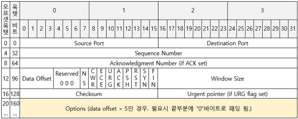

# OSI 7 계층

* 계층을 나눈 이유는 통신이 일어나는 과정이 단계별로 쉽게 파악할 수 있기 때문이며, 특정한 곳에 이상이 생기면 이상이 생긴 단계만 고칠 수 있기 때문이다.
* 예를 들어, PC방에서 게임을 하다가 연결이 끊어졌을 경우
  * 모든 PC에 문제가 있다면, 네트워크 계층인 라우터를 살펴보거나 광랜을 제공하는 회사의 회선(물리계층)에 문제가 생긴 것으로 추측할 수 있다.
  * 한 PC에만 문제가 있다면, 게임 소프트웨어의 문제(어플리케이션 계층)이거나 스위치(데이터링크 계층)에 문제가 있다고 추측할 수 있다.

1. 물리계층 : 1계층

   * 전기적, 기계적 특성을 이용해 통신케이블로 데이터를 전송한다.

   * 이 계층에서 사용하는 통신계층은 비트이며 1,0이고 전기적으로 On, Off 상태라고 생각하면 된다.

   * 이 계층은 데이터만 전달할 분 **데이터가 무엇인지, 어떤 오류가 있는지 신경쓰지 않는다.**

   * 통신케이블, 리피터, 허브 등이 포함된다. 
2. 데이터 링크 계층 : 2계층
   * 물리계층을 통해 송수신되는 정보의 **오류와 흐름을 관리하고 도와주는 역할**을 수행한다. 
   * 따라서 **오류 검출, 재전송** 등의 기능을 가지고 있다. 
   * 이 계층에서는 **맥 주소를 가지고 통신**한다. 
   * 브릿지, 스위치(mac 주소 테이블을 이용해 해당 프레임 전송)를 통해 물리 계층에서 받은 정보를 전달한다.
   * 데이터 링크 계층은 포인트 투 포인트간 신뢰성 있는 전송을 보장하기 위해 오류 제어와 흐름제어를 한다.
     * 흐름제어는 3가지 : randomness , controlled, channelized
3. 네트워크 계층(datagram) : 3계층 
   * 데이터를 목적지까지 안전하고 빠르게 전달하는 **라우팅 기능**을 수행한다.
   * 이 계층은 이동할 경로를 선택하여 경로에 따라 패킷을 전송한다.
     * 대표적인 장비는 라우터이고, 요즘은 2계층 장비 중 스위치에 라우팅기능을 장착한 layer 3 스위치도 있다.
   * 전송 계층이 요구하는 서비스 품질을 제공하기 위해 기능적, 절차적 수단을 제공한다. 
   * 라우팅, 흐름제어, 세그먼테이션 등을 수행합니다.
4. 전송계층 (segment) : 4계층
   - TCP, UDP 프로토콜을 통해 통신을 활성화한다.
     - 데이터가 왔다면 4계층에서 데이터를 하나로 합쳐서 5계층으로 넘긴다.
     - 상위 계층들이 데이터 전달의 유효성이나 효율성을 생각하지 않도록 도와준다.
5. 세션계층 : 5계층
   * 데이터가 통신하기위해 논리적 연결을 담당합니다.
     * 하지만 4계층에서도 연결을 맺고 종료할 수 있기 때문에 어느 계층에서 통신이 끊겼는지 판단하기 한계가 있다.
     * 그러므로 세션 계층은 4 계층과 무관하게 응용프로그램 관점에서 봐야한다.
   * 세션 설정, 유지, 종료
   * 세션 계층은 응용 프로세스가 통신을 관리하기 위한 방법을 제공
     * **동시 송수신 방식(duplex), 반이중 방식(half-duplex), 전이중 방식(Full Duplex)**
     * 전이중  방식은  하나의  연결을  통하여  데이터가  동시에  양  방향으로  오고  갈  수  있는  방식
     * 반이중  방식일  경우에는  대화  관리를  위해  데이터  토큰(data token)을  사용
6. 표현 계층 : 6계층
   * 데이터 표현에 대한 독립성을 제공하고 암호화하는 역할을 담당한다
   * 파일 인코딩, 명령어 포장, 압축 암호화 합니다.
   * 해당 데이터가 TEXT인지, 그림인지, GIF인지 JPG인지의 구분 등이 표현 계층의 몫
7. 응용계층 : 7계층
   * 응용 프로세스와 관계하여 응용 서비스를 수행합니다.
   * 최종 목적지로서 HTTP, FTP, SMTP, POP3, IMAP, Telnet 등과 같은 프로토콜

[OSI 7 계층이란?, OSI 7 계층을 나눈 이유 :: effortDev (tistory.com)](https://shlee0882.tistory.com/110)

 

> [추가적인 내용 : TCP/IP]
>
> * TCP / IP 계층은 
>
>   * Application layer : 특정 서비스를 제공하기 위해 어플리케이션 끼리 정보를 주고 받음
>     * FTP, HTTP, SSH, Telnet, DNS, SMTP
>   * Transport layer : 송신된 데이터를 수신측 어플리케이션에 전달
>     * TCP, UDP, RTP, RTCP
>   * Internet layer
>     * 수신 측 까지 데이터를 전달하기 위해 사용
>     * IP, ARP, ICMP, RARP 
>   * network access layer
>     * 네트워크 직접 연결된 기기간 전송가능
>     * 이더넷
>
> * 검색 창에 www.google.com으로 검색한다는 것은 ?
>
>   1. 구글 웹서버인 80포트를 http request 메세지를 보내는 것이다.
>      * (application = HTTP, transport = TCP, Internet layer = IP, Network access layer = 이더넷) 사용 가정
>
>   2. 패킷의 application layer에는 http request가 들어간다.
>   3. tcp 프로토콜에서 중요한 것은 시작포트와 목적포트이다. 여기서는 웹 서버이기 때문에 80번이다.
>      * tcp 헤더
>      * 
>
>   4. ip 프로토콜에서 중요한 것은 시작 ip 주소와 목적지 ip이다.
>      1. 시작 ip는 알지만, 목적지 ip는 알지 못한다.
>      2. DNS 프로토콜로 도메인 주소로 ip 주소를 알 수 있다.
>      3. 브라우저는 os에게 구글의 ip주소를 물어보고 DNS 서버로 요청을 보낸다. (port 53)
>         * os가 DNS의 서버주소를 알고 있는 이유는 이미 컴퓨터에 등록되어 있기 때문
>   5. 이더넷 프로토콜의 헤더를 만들어야 한다. 
>      1. MAC 주소를 알아와야 함
>         * 여기서 MAC 주소는 구글 MAC 주소 대신, 물리적으로 연결된 우리집 공유기 MAC 주소가 필요하다. (우리집 공유기를 게이트웨이라고 하기도 한다)
>         * ARP : IP주소로 MAC 주소로 바꿔주는 주소 해석 프로토콜 
>   6. 패킷을 완성시켰으면 보낼 수 있다. 그런데 그 전에 TCP는 3way handshaking을 통해 연결한다.
>   7. 우리집 공유기로부터 구글서버까지 여러 라우터에 걸쳐 도착한다. 
>   8. 구글서버가 연결된 라우터까지 도착하면 패킷의 IP헤더에 기록된 구글 서버 IP주소를 통해 MAC주소를 알아오고 데이터를 전송한다.
>      1. 이 때 ARP 프로토콜을 통해 MAC 주소를 알아온다.
>      2. 라우터에 연결된 네트워크에 브로드캐스팅하게 되고, 목적지인 구글 서버가 자신의 IP온 ARP를 받고 MAC 주소를 반환
>      3. MAC주소를 알았기 때문에 데이터를 물리적으로 전송할 수 있다.
>   9.  (nternet layer, Network access layer 활용으로) 목적지로 데이터 도착
>   10. transport layer의 포트번호를 확인하고, 80번 포트를 사용하는 어플리케이션에게 데이터를 전달해줌
>   11. 어플리케이션까지 오면 웹서버가 사용될 http request 데이터를 얻게 된다.
>   12. 서버에서 정상적으로 http request를 받고, 응답으로 돌려준다.
>   13. 4 way handshake으로 연결을 닫는다.
>
>   
>
>   참고자료 : [ 8.인터넷의 TCP/IP 데이터 전송 과정(ft. 캡슐화와 역캡슐화) ](https://better-together.tistory.com/89)
>
>   참조자료 : https://devlopsquare.tistory.com/233#google_vignette

# TCP 3 way handshake & 4 way handshake

- 3-way handshaking를 통해 연결지향적이고, 신뢰성 있는 데이터 전송이 가능합니다.
  - **서버** : socket() 생성 → bind() 소켓 특정포트 연결 → listen() 연결요청 대기상태 → accept() 연결허용 → read/write() 데이터 송수신 → close() 연결종료
  - **클라이언트** : socket() 생성 → connect() 연결요청 → read/write() 데이터 송수신 → close() 연결종료
- 3-way handshaking
  1. client -> server : SYN
  2. server -> client : ACK+SYN
  3. client -> server : ACK
- 4-way handshaking 
  1. client → server : Fin
  2. server → client : ack 보내고 모든 데이터 전송 완료 후 fin 전송
  3. client → server : ack을 보내고 time wait를 통해 기다린다.
  4. server는 ack을 받고 서버를 닫는다.

> 찾아보기 !
>
> * SYN은 synchronize '동시에 발생하다'의 약자로, 다른 컴퓨터로 전송 된 TCP 패킷으로 연결이 이루어 지도록 요청합니다. 발생시킨다는 의미! 
> * ACK : acknowledgment

# TCP/IP 흐름제어 & 혼잡제어

> TCP/IP 

* IP 주소 체계를 따르며 TCP 특성을 활용해 송신자와 수신자의 논리적 연결을 생성하고 신뢰성을 유지할 수 있도록 하겠다는 의미

> IP 계층

* 네트워크의 주소(IP 주소)를 정의하고, **IP 패킷의 전달과 라우팅을 담당**하는 계층
* IP계층은 네트워크 계층에 해당
* IP 계층은 데이터 링크 계층의 하드웨어적 특성에 관계없이 독립적인 역할을 수행
  * IP 계층 상의 주요 프로토콜
    * 패킷의 전달을 책임지는 IP
    * 패킷 전달 에러의 보고 및 진단을 위한 ICMP
    * 복잡한 네트워크에서 인터네트워킹을 위한 경로를 찾게해주는 라우팅 프로토콜 

> IP 프로토콜

* IP 프로토콜은 신뢰성(에러제어)와 흐름제어 기능이 없다.
* 그래서 신뢰성을 확보하기 위해서는 IP 계층 위의 TCP같은 전송 계층에 의존해야한다.
* 비연결적이고, 비신뢰적이다.

> TCP 프로토콜

* 전송계층에 해당하고
* 신뢰적인 전송을 보장함으로써, 어플리케이션 구현이 한층 쉬워진다.
* 패킷 손실, 중복, 순서 바뀜 등을 보장하고 IP 계층의 신뢰성 없는 서비스에 대해 신뢰성을 제공한다.
* TCP는 연결지향적이다.

> 전송 과정

- Application layer : sender application layer가 socket에 data를 씀.
- Transport layer : data를 segment에 감싼다. 그리고 network layer에 넘겨줌.
- 그러면 아랫단에서 어쨋든 receiving node로 전송이 됨. 이 때, sender의 send buffer에 data를 저장하고, receiver는 receive buffer에 data를 저장함.
- application에서 준비가 되면 이 buffer에 있는 것을 읽기 시작함.
- 따라서 flow control의 핵심은 이 receiver buffer가 넘치지 않게 하는 것임.
-  receiver는 RWND(Receive WiNDow) : receive buffer의 남은 공간을 알립니다.

> 흐름제어

* 흐름제어 : 송신 측과 수신 측의 데이터 처리 속도 차이를 조절
* Stop and Wait와 Sliding Window 기법이 있다.
* Stop and Wait는 매번 전송 패킷에 대한 확인 응답을 받아야 다음 패킷을 전송할 수 있기 때문에 비효율적이다.
* Sliding Window는 데이터의 흐름을 동적으로 조절할 수 있다.
  * TCP/IP를 사용하는 모든 호스트들은 송신하기 위한 것과 수신하기 위한 2개의 Window을 가지고 있다.
  
  * 수신자는 TCP 헤더 내에 Window size를 사용해 한번에 받고 보낼 수 있는 데이터 양을 결정한다. 이것은 3-way handshake에 정한다. 후에 window size 를 조절한다.
  
  * Sliding Window 방식은 일정한 윈도우 크기 내에서 한번에 여러 패킷을 송신하고, 
  
    한번의 ACK로 수신확인을 하며, 윈도우 크기를 변경시키며 흐름제어 하는 기법이다

* TCP 윈도우를 이야기 하기 위해서는 세가지의 변수를 알아야한다.
* 수신 윈도우, 혼잡 윈도우(혼잡제어와 관련), 송신 윈도우
* 송신윈도우는 수신윈도우와 혼잡윈도우 중 작은 것으로 결정한다.
* 송신 윈도우의 크기가 클수록 많은 데이터를 보낼 수 있다.

* 네이글 알고리즘은 다음과 같다.
  1. 전송하기 위한 새로운 데이터가 있으면
     1. **MSS** 보다 송신 윈도우 사이즈가 같거나 크고 & 이용할 수 있는 데이터가 **MSS** 보다 같거나 큰 경우 **MSS** 만큼 세그먼트를 보낸다.
     2. 그렇지 않다면,
        1. 만약 파이프에 여전히 확인 되지 않은 데이터가 있으면
           1. 확인 응답을 받을 때 까지 데이터를 버퍼에 더한다.
        2. 그렇지 않으면,
           1. 즉시 보낸다.
  
* 네이글 알고리즘은 네트워크망의 혼잡을 피하기 위해 설계되었다.

* 만약에 송신측 프로세스에서 송신 버퍼로 작은 데이터 단위로만 계속 밀어(PUSH)낸다고 한다면, 패킷당 IP 헤더와 TCP 헤더에 의해 (IPv4기준 40 bytes, 옵션) 오버헤드 비율이 더 커지게 된다.

  * 예시로 송신측이 수신측으로 90 bytes를 보내되 송신 버퍼가 크게 상관없이 데이터가 채워지자 마자 전송한다고 가정한다.

    그리고 프로세스는 세 번에 걸쳐서 데이터를 송신 버퍼로 밀어낸다고 가정한다.

     

    헤더(40bytes) + 데이터(10 bytes),

    헤더(40bytes) + 데이터 (20 bytes),

    헤더(40bytes) + 데이터 (60 bytes)

     

    데이터 90 bytes를 보내기 위해 헤더 120 bytes의 헤더를 보내야 하는 상황이 발생한다. -> 윈도우 신드롬이라고 합니다.

    즉 네트워크망을 비효율적으로 사용하는 것이다.

    실제로 총 전송된 패킷 210 bytes 중 헤더 비율이 약 57%이다.
    
    

* 단점 
  * 이전에 보낸 응답을 기다려야 한다.
  * 네이글 알고리즘이 지연 응답 방식과 비교하여 round trip 횟수가 증가 한다.
  * 기다리는 것은 MSS 만큼 데이터가 채워질 때까지 혹은 타이머에 의해 timeout 될 때까지 패킷이 전송되지 않음을 의미한다.

> 추가 자료 : 
>
> 네트워크 게임에서 네이글을 적용시켰을 때, 반응성과 효율성 두가지를 모두 얻을 수 있을까? 게임 서버와 클라이언트에서 네이글을 사용했다는 상상실험을 통해 그 결과를 유추해보자.
>
> 클라이언트 ->
>
> 온라인 게임의 네트워크 상황을 생각해보자. 클라이언트의 경우 서버로 유저의 입력을 전송
>
> 이 경우 데이터 양 자체가 작고, 또 반복적으로 여러 입력이 요청될 수 있음.
>
> 만약 네이글 알고리즘을 사용하면, 패킷이 크기가 작다는 이유로 지연되기 때문에 사용자의 반응성에 큰 영향을 미치게된다. 
>
> 입력 패킷은 크기는 작아도 게임에 있어 그 의미는 매우 크기 때문에 클라이언트 네트워크의 경우에는 네이글 알고리즘을 사용하지 않는 것이 유리.
>
> 서버 -> 
>
> 서버는 클라이언트에게 현제 유저가 처한 게임 상황의 결과를 지속적으로 보내줄 것이다. 이 정보는 큰 양의 데이터이다. 이러한 데이터가 네이글 알고리즘에 의해 지연되는 경우는 수신자의 가용 윈도우 사이즈가 충분히 크지 않은 경우가 될 것이다. 클라이언트의 처리 능력이 원활하지 않은 경우 계속해서 데이터를 잘라서 우겨넣는것이 좋지 안다.
>
> 또한 동시에 여러 클라이언트가 사용하는 서버에서 트래픽이슈는 민감한 부분이기 때문에, 네이글 알고리즘을 사용하는 것이 좋지 않나..
>
> 
>
> 출처: https://ozt88.tistory.com/18 [공부 모음]

> 혼잡제어

혼잡제어 : 네트워크 내의 패킷 수가 넘치게 증가하지 않도록 방지

한 라우터에 데이터가 몰릴 경우, 자신에게 온 데이터를 모두 처리할 수 없게 된다. 이 경우 호스트들은 또 다시 재전송을 하게되고 결국 혼잡을 가중시켜 오버플로우나 데이터 손실을 발생시킨다. 그래서 네트워크내 패킷수를 방지하는 것이 혼잡제어라고 한다.

AIMD(Additive Increase / Multiplicative Decrease)

- 처음에 패킷을 하나씩 보내고 이것이 문제없이 도착하면 window 크기(단위 시간 내에 보내는 패킷의 수)를 1씩 증가시켜가며 전송하는 방법
- 패킷 전송에 실패하거나 일정 시간을 넘으면 패킷의 보내는 속도를 절반으로 줄인다.
- 공평한 방식으로, 여러 호스트가 한 네트워크를 공유하고 있으면 나중에 진입하는 쪽이 처음에는 불리하지만, 시간이 흐르면 평형상태로 수렴하게 되는 특징이 있다.
- 문제점은 초기에 네트워크의 높은 대역폭을 사용하지 못하여 오랜 시간이 걸리게 되고, 네트워크가 혼잡해지는 상황을 미리 감지하지 못한다. 즉, 네트워크가 혼잡해지고 나서야 대역폭을 줄이는 방식이다.

Slow Start (느린 시작)

* AIMD가 전송 속도를 올리는데 시간이 오래 걸리는 단점이 존재
* slow start : 한 세그먼트가 ack받으면 1MSS 증가한다. 즉, 지수적으로 증가한다. 혼잡이 발생하면 1부터 다시 시작하며 혼잡 발생 시점의 절반은 SSThresh 으로 지정한다. 그리고 다시 slow start를 시작하고 SSThresh 도달하면 congestion avoidance phase 로 RTT마다 1 MSS씩 증가합니다.

- fast retransmission :  타임아웃으로 loss를 기다리는 것이 아니라, 3번의 duplicate ack으로 loss를 판단하여 재전송한다.

- fast recovery : 3번의 duplicate ack이 오면 loss로 판단하여 반으로 줄이고, congestion avoidance phase부터 시작한다.

  		* 	slow start + congestion avoidance + fast retransmission = TCP Tahoe
  	
  		* 	TCP Tahoe + Fast Recovery -> TCP reno

  

https://gyoogle.dev/blog/computer-science/network/%ED%9D%90%EB%A6%84%EC%A0%9C%EC%96%B4%20&%20%ED%98%BC%EC%9E%A1%EC%A0%9C%EC%96%B4.html

https://roka88.dev/114

# UDP

* 전송 계층 중 하나로 TCP에 비해 신뢰성이 낮은 프로토콜이다. 
* 비연결적이고 신뢰성이 없으며, 순서화 되지 않은 datagram 서비스를 제공한다. 
* 하지만 빠른 요청과 응답이 필요한 실시간 응용에 적합하고 여러 다수 지점에 전송이 가능하다.
* 또한 헤더가 단순하고 작아(8바이트) 헤더 처리에 많은 시간을 요하지 않는다.

### # DNS(domain name service)에서 UDP를 사용하는 이유

- request 양이 적다 → UDP request에 담길 수 있다.
  - UDP segment에 들어갈 수 있음.
- 3 way handshking으로 연결을 유지할 필요가 없다 → connection을 유지할 필요 x
- request에 대한 손실은 application layer에서 제어가 가능하다.
  - DNS는 application layer이고, 모든 application layer는 TCP, UDP 중 하나의 transport layer를 사용해야한다.
- 연결 상태가 없기 때문에 더 많은 클라이언트를 수용할 수 있다.
- DNS : port 53
- TCP 사용하는 이유
  - Zone transfer : DNS 서버간의 요청을 주고 받을 때의 transfer
  - 데이터가 512 바이트를 넘어가거나 응답을 못받은 경우

[신뢰적인 TCP보다 비신뢰적인 UDP를 사용하는 이유 (tistory.com)](https://rain-bow.tistory.com/entry/신뢰적인-TCP보다-비신뢰적인-UDP를-사용하는-이유)