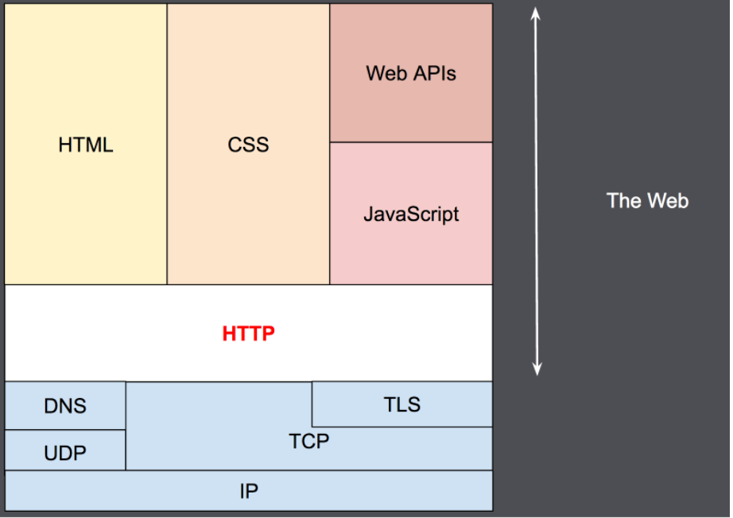
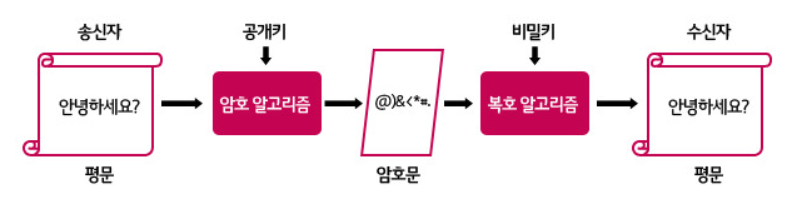

### 웹 프로토콜 도식

## HTTP 프로토콜
- [HTTP 개요](https://developer.mozilla.org/ko/docs/Web/HTTP/Overview)
- 정의, 특징, 메소드, 역사(각 버전별 특징), 헤더와 메시지(request, response)

### 정의
텍스트 기반의 통신 규약으로 **인터넷에서 데이터를 주고받을 수 있는 프로토콜.**

### 특징
비연결성, 무상태

- 비연결성
    - **클라이언트와 서버가 한 번 연결을 맺은 후, 클라이언트 요청에 대해 서버가 응답을 마치면 맺었던 연결을 끊어 버리는 성질이다.**

- 무상태성
    - Connectionless로 인해 **서버는 클라이언트를 식별할 수가 없는데**, 이를 Stateless라고 합니다.

### 각각의 보완책

- 비연결성을 보완하기 위해 keep-alive헤더 사용(Http1.1)
- 무상태성을 보완하기 위해 쿠키, 세션, 토큰을 통해 상태기억.

### HTTP 메소드

- 정의된 메소드는 더 많지만 보통 5개의 메소드만 사용합니다.

- GET
    - GET 메서드는 특정 리소스의 표시를 요청합니다. GET을 사용하는 요청은 오직 데이터를 받기만 합니다.

- POST
    - POST 메서드는 특정 리소스에 엔티티를 제출할 때 쓰입니다. 이는 종종 서버의 상태의 변화나 부작용을 일으킵니다.

- PUT
    - PUT 메서드는 목적 리소스 모든 현재 표시를 요청 payload로 바꿉니다.

- DELETE
    - DELETE 메서드는 특정 리소스를 삭제합니다.
- PATCH
    - PATCH 메서드는 리소스의 부분만을 수정하는 데 쓰입니다.

### GET과 POST 비교

GET : 정보 요청, body에 담지않고 파라미터 쿼리로 전송
POST : 데이터를 body에 담아서 리소스를 생성하거나 변경

- GET의 특징
    - URL에 데이터를 포함시켜 요청한다.
    - 데이터를 헤더에 포함하여 전송한다.
    - URL에 데이터가 노출되어 보안에 취약하다.
    - 전송하는 길이에 제한이 있다.

- POST의 특징
    - URL에 데이터를 노출하지 않고 요청한다.
    - 데이터를 Body에 포함시킨다.
    - URL에 데이터가 노출되지 않아서 기본 보안은 되어있다.
    - 전송하는 길이에 제한이 없다.

- 추가로 준비할 것?
    - 각 메소드들의 사용방법
    - response, request 메시지 형식과 의미 이해하기.
    - 각 요청을 보냈을 때의 흐름
    - 각 버전 별 특징 이해하기

### HTTP헤더와 메시지

### HTTP 2.0 버전 특징

### 2-1. HTTP 1.1의 결점(Why HTTP 1.1 Is Slow?)

1. **One Connection - One Response**

HTTP1.1은 한번에 한응답만 처리하도록 구성되어있다 이로 인해 성능상의 저하가 존재한다.

- **HOL(Head Of Line) Blocking - 특정 응답의 지연**

: HOL Blocking이란, 네트워크에서 같은 큐에 있는 패킷이 첫번째 패킷으로 인해 지연되는 경우 발생하는 성능 저하 현상을 의미한다. 직관적인 예시로, 일차선 도로에서 앞차가 좌회전 신호를 기다리는 동안에, 내가 직진을 하고 싶어도 할 수 없듯이, 패킷이 다른 패킷을 기다리느라 지연이 되는현상을 의미한다.

- **RTT(Round Trip Time) 증가**

: HTTP는 기본적으로 Connection당 하나의 요청을 처리하도록 설계되있다(3-way handshaking)

동시전송이 불가능하고 요청과 응답이 순차적으로 이루어지는 구조여서 리소스 개수에 비례하여, 대기시간이 길어진다. 구체적인 예로 하나의 큰이미지를 전송하는 것보다 그것을 잘게 쪼갠 100 개의 이미지를 전송하는데 더 오랜 시간이 소모 된다.

2. **무거운 Header 구조**

: Http/1.1의 헤더에는 많은 메타정보들과 실제로 전송할 정보 등 많은 정보들이 저장되어 있다. 이 무거운 헤더를 매 요청시마다 전송하게되며(순수 HTTP1.1 가정), domain에 설정된 cookie정보도 헤더에 포함되어 전송된다. 극단적으로 위의 예에서 처럼 전송하라는 정보는 "hello" 한 단어인데, 헤더가 더 큰 경우가 자주 발생한다.

### 2-2. HTTP 2.0의 해결.

: SPDY(스피디) 기반의 HTTP 2.0의 등장. **Better Performance**

1. **Mutiplexed Streams**

    : 한 커넥션으로 **동시에 여러개의** 메시지를 주고 받을 수 있으며, 응답또한 순서에 상관없이 스트림으로 주고 받는다. 스트림에 우선순위를 설정하는 것을 통해서 응답이 어느 순서로 오건 상관없이 처리가 가능해졌다.

 2. **Header Compression**

  : Header 정보 압축을 위해 Header Table(헤더에 대한 정보를 각각 에서 보유)와 Huffman Encoding 기법을 사용하여 처리하며 이는 HPACK이라고 불린다. 구체적으로 중복된 Header에 대한 정보는 index 값만 전송하고, 중복되지 않은 Header 정보의 값은 인코딩하여 전송한다. 

---

**기존 결점의 해결에서 나아간 HTTP 2.0의 기능/변화.**

3. **Server Push**

서버가 클라이언트 요청에 대해 여러 응답을 한번에 보낼 수 있다. 즉, 서버는 요청에 응답할 뿐만 아니라 클라이언트가 명시적으로 요청하지 않아도 추가적인 리소스를 클라이언트에 푸시할 수 있다. 엄격한 Ack - Repsonse 체계에서 벗어나, 서버가 미리 클라이언트가 필요한 정보를 인지하고 푸쉬함으로써, 좀 더 빠른 응답을 받을 수 있도록 한다.

4. **바이너리 프레이밍 계층**

 줄바꿈으로 구분되는 일반 텍스트 HTTP/1.x 프로토콜과 달리, 모든 HTTP/2 통신은 더 작은 메시지와 프레임으로 분할되며, 각각은 바이너리 형식으로 인코딩되어 있다. 더 작은 메시지와 프레임으로 분할함으로써, 더 많은 종류의 정보를 전달할 수 있게되었다(스트림의 구현 등)

### 요약 

A. HOL 블로킹과 RTT 지연을 일으키는 하나의 요청만을 한번에 처리할 수 있는 HTTP1.1의 문제를, HTTP 2.0에서는 멀티플렉싱을 지원함으로써 개선하였다.(하나의 연결로 여러개 메시지 전송가능)

B. 무거운 헤더로 인한 중복 정보 전달문제를 HTTP2.0에서는 HPACK(Header Table, 허프만 인코딩)을 이용해 헤더를 압축 시켰다.

C. 이외의 HTTP 2.0의 핵심적인 변화는 Server Push와 바이너리 프레이밍 계층이며, 이들 또한 성능향상에 도움을 주었다.

(Server Push: 클라이언트가 요청하지 않았으나 필요한 정보 보내줌)

(바이너리 프레이밍: 더 작은 메시지와 프레임으로 분할해서 더 많은 정보 전달.)

### 참고
 - HTTP버전별 정리: https://www.youtube.com/watch?v=xcrjamphIp4

## HTTP & HTTPS
- https와 http 차이, ssl handshaking 과정, 대칭키와 비대칭키(공개키), 언제 어떤걸 사용할까?

### HTTPS란
`
 HyperText Transfer Protocol over Secure Socket Layer, HTTP over TLS, HTTP over SSL, HTTP Secure 등으로 불리는 HTTPS는 HTTP에 데이터 암호화가 추가된 프로토콜이다. HTTPS는 HTTP와 다르게 443번 포트를 사용하며, 네트워크 상에서 중간에 제3자가 정보를 볼 수 없도록 공개키 암호화를 지원하고 있다.
`

### HTTP와 HTTPS의 차이점

HTTP는 암호화가 추가되지 않았기 때문에 보안에 취약한 반면, HTTPS는 안전하게 데이터를 주고받을 수 있다. 하지만 HTTPS를 이용하면 암호화/복호화의 과정이 필요하기 때문에 HTTP보다 속도가 느리다.(오늘날에는 거의 차이를 못느낄 정도이다.) 또한 HTTPS는 인증서를 발급하고 유지하기 위한 추가 비용이 발생하다.

그렇다면 언제 HTTP를 쓰고, 언제 HTTPS를 쓰는 것이 좋겠는가?

개인 정보와 같은 민감한 데이터를 주고 받아야 한다면 HTTPS를 이용해야 하지만, 단순한 정보 조회 등만을 처리하고 있다면 HTTP를 이용하면 된다.

- HTTP 동작 순서 : TCP → HTTP
- HTTPS 동작 순서 : TCP → SSL(TLS) → HTTP (TLS 핸드쉐이킹 과정을 거친다.)

 SSL 프로토콜은 정보를 암호화시키고 이때 공개키와 개인키 두가지를 이용한다.

- HTTPS는 인터넷 상에서 정보를 암호화하기 위해 SSL 프로토콜을 이용해 데이터를 전송하고 있다는 것을 말한다. 즉, 문서 전송시 암호화 처리 유무에 따라 HTTP와 HTTPS로 나누어지는 것

- 모든 사이트가 HTTPS로 하지 않는 이유는, 암호화 과정으로 인한 속도 저하가 발생하기 때문이다.

## TLS/SSL HandShaking 과정

HTTPS는 TCP 핸드쉐이크를 거쳐 SSH handshake 완료 후에 통신을 시작한다. 구체적인 ssh hanshaking과정은 다음과 같다.
기본적으로 브라우저에 CA정보와 CA리스트는 내장되어있다

1. Client Hello

브라우저 마다 지원하는 암호화 알고리즘과 TLS 정보를 전송하며, 클라이언트에서 생성한 난수값, 세션 ID를 전송합니다.

2. Server Hello

사용할 TLS 버전, 사용할 암호화 알고리즘, 서버에서 생성한 난수값, 서버의 공개키, 서버의 인증서를 전송합니다.

3. Client

브라우저에 내장되어있는 CA의 공개키로 서버가 보낸 인증서를 복호화 합니다.

복호화 되면 CA에 의해 인증서가 발급된 것이므로 서버의 신원이 확보됩니다. 

클라이언트 난수값과 서버 난수 값을 통해 pre-master-key 라는 것을 전송합니다. 

pre-master-key를 **서버의 공개키**를 통해 암호화 합니다(서버의 비공개키로만 복호화 가능합니다)

이 값을 대칭키로 사용합니다.

4.  Server

클라이언트로 부터 전송받은 pre-master-key를 정상적으로 복호화 후 master-key(대칭키)로 승격시킵니다.

5. 상호 통신

위 과정을 통해서 공개키 방식으로 대칭키를 안전하게 설정하여 대칭키를 통해 데이터를 송, 수신하게됩니다.

[https://opentutorials.org/course/228/4894](https://opentutorials.org/course/228/4894)

## 대칭키 & 공개키

### 대칭키
대칭키 암호화 :암호화와 복호화에 사용하는 키가 같은 암호화 알고리즘

### 공개키
공개키 암호화: 개인키로 암호화하면 공개키로 복호화, 공개키로 암호화하면 개인키로 복호화 가능한 알고리즘.

- 언제 공개키를 사용하는게 좋을까, 언제 대칭키를 사용하는게 좋을까?
- 대칭키 공개키가 아닌 다른 방법은 없을까?

## 로드 밸런싱(Load Balancing)

분산식 웹 서비스로 여러 서버에 부하(Load)를 나누어 줌, Round Robin, Least Connection, Response Time, Hash 등의 기법이 있음

1) Round Robin : 각 서버에 session을 순서대로 연결하는 방식, 모든 클라이언트를 똑같이 취급 하고, 서버별 처리량을 기억하고 있어야 함

2) Least Connextion : 클라이언트와 서버별 연결된 connection 수를 고려하여 가장 적은 서버에 연결하는 방식

로드 밸런싱은 api gateway나 proxy서버 등에서 주로 처리한다.

### 실제 적용

[https://engineering.linecorp.com/ko/blog/how-line-messaging-servers-prepare-for-new-year-traffic/](https://engineering.linecorp.com/ko/blog/how-line-messaging-servers-prepare-for-new-year-traffic/)

[https://d2.naver.com/helloworld/6070967](https://d2.naver.com/helloworld/6070967)

- 만일 질문이 나온다면 어느 경우에 적용할 수 있을지도 알면 좋을 것 같음
## Blocking/Non-blocking & Synchronous/Asynchronous

[https://musma.github.io/2019/04/17/blocking-and-synchronous.html](https://musma.github.io/2019/04/17/blocking-and-synchronous.html)

동기/비동기 - 작업 주체 여러개, 작업 종료에 관심이 있느냐 없느냐가 중점

블로킹/논블로킹 - 작업이 여러개. 제어권이 누구한테 있느냐가 중점.

동기 : 시작과 종료를 동시에 하거나, 하나가 끝나면 다른 하나가 시작하는 경우, 결과를 바로 처리해야함

비동기 : 별도의 시작/종료를 가짐, 결과를 바로 처리 안해도됨.

블로킹 : 작업을 하다가 다른 작업이 완료될때까지 기다렸다가 다시 수행

넌블로킹 : 다른 작업과 관련없이 자기 작업 계속함

[https://www.youtube.com/watch?v=oEIoqGd-Sns](https://www.youtube.com/watch?v=oEIoqGd-Sns)

- 자신의 사용하는 언어의 sync, async 동작하는 메소드 or 라이브러리를 알면 좋을 듯
- 각 요소들의 구체적인 예시 숙지하기.

## Blocking I/O & Non-Blocking I/O

### Blocking I/O

- Blocking I/O Model이란
  - cpu의 기본적인 I/O 모델로 리눅스에서 **모든 소켓 통신**은 기본 blocking으로 동작한다.
  - **I/O 작업이 진행되는 동안 유저 프로세스는 자신의 작업을 중단한 채 대기하는 방식이다.**
  - C언어나 JAVA언어로 실행하고 터미널창이 깜빡이는 모습

I/O Blocking 형태의 작업은

(1) Process(Thread)가 Kernel에게 I/O를 요청하는 함수를 호출
(2) Kernel이 작업을 완료하면 작업 결과를 반환 받음.

#### 특징
- I/O 작업이 진행되는 동안 user Process(Thread) 는 자신의 작업을 중단한 채 대기
- Resource 낭비가 심함
- (I/O 작업이 CPU 자원을 거의 쓰지 않으므로)

여러 Client 가 접속하는 서버를 Blocking 방식으로 구현하는 경우 -> I/O 작업을 진행하는 작업을 중지 -> 다른 Client가 진행중인 작업을 중지하면 안되므로, client 별로 별도의 Thread를 생성해야 함 -> 접속자 수가 매우 많아짐

이로 인해, 많아진 Threads 로 컨텍스트 스위칭 횟수가 증가함,,, 비효율적인 동작 방식

### Non-Blocking I/O
I/O 작업이 진행되는 동안 User Process의 작업을 중단하지 않음.(그림은 sync까지 반영된 듯 함)

#### 진행 순서

- User Process가 recvfrom 함수 호출 (커널에게 해당 Socket으로부터 data를 받고 싶다고 요청함)
- Kernel은 이 요청에 대해서, 곧바로 recvBuffer를 채워서 보내지 못하므로, "EWOULDBLOCK"을 return함.
- Blocking 방식과 달리, User Process는 다른 작업을 진행할 수 있음.
- recvBuffer에 user가 받을 수 있는 데이터가 있는 경우, Buffer로부터 데이터를 복사하여 받아옴.

이때, recvBuffer는 Kernel이 가지고 있는 메모리에 적재되어 있으므로, Memory간 복사로 인해, I/O보다 훨씬 빠른 속도로 data를 받아올 수 있음.

recvfrom 함수는 빠른 속도로 data를 복사한 후, 복사한 data의 길이와 함께 반환함.

#### async blocking IO (이 ibm에서의 분류에 오류가 있다는 의견도 있다):

- 이 모델에서는 IO는 non-blocking이지만, **통지(notification)는 async 방식**으로 하도록 되어있다.
- select() 는 유저 프로세스를 block 한다.
- select() 는 데이터가 사용이 가능해지면, 통지를 받게됨. 통지를 받으면 block을 품

#### [#](https://limdongjin.github.io/concepts/blocking-non-blocking-io.html#async-non-blocking-io)async non-blocking IO:

- 시스템 콜이 들어오면, 커널은 IO 작업의 완료 여부와는 무관하게 **즉시 응답을 해준다.**

- **유저 프로세스는 IO 가 완료 되기 전에도 다른 작업을 할수있는 것이다.**

- IO 처리는 백그라운드에서 실행되다가,

  완료되면 커널이 유저 프로세스에게 알려줌

  - 이는 sync non-blocking IO와의 차별점이라고 볼수있다.
  - **sync nonblocking IO**는 유저 프로세스가 **IO 완료 여부를 커널에게 계속 물어봐야 했지만,**
  - **async non-blocking IO**는 **IO 완료가 되면 그때 커널이 유저프로세스에게 알려주는 방식**이므로

출처 : https://limdongjin.github.io/concepts/blocking-non-blocking-io.html#ibm-%E1%84%8B%E1%85%A1%E1%84%90%E1%85%B5%E1%84%8F%E1%85%B3%E1%86%AF

## Web Cache 이해하기
### 캐싱이란?

- 캐싱(Caching)은 애플리케이션의 처리 속도를 높여준다. 이미 가져온 데이터나 계산된 결과값의 복사본을 저장함으로써 처리 속도를 향상시키며, 이를 통해 향후 요청을 더 빠르게 처리할 수 있다. 대부분의 프로그램이 동일한 데이터나 명령어에 반복해서 엑세스하기 때문에 캐싱은 효율적인 아키텍처 패턴이다.
- **지역성의 원리**를 이용

### Local Cache vs Global Cache

- Local Cache
  - 서버마다 캐시를 따로 저장한다.
  - 다른 서버의 캐시를 참조하기 어렵다.
  - 서버 내에서 작동하기 때문에 속도가 빠르다.
  - 로컬 서버 장비의 Resource를 이용한다. (Memory, Disk)
  - 캐시에 저장된 데이터가 변경되는 경우:
    - 해당 서버를 제외한 모든 peer에 변경 사항 전달
    - All-to-All Replication
    - WAS 인스턴스가 늘어나고, 캐시 저장 데이터 크기가 커지면 성능이 저하되는 이유는 이 때문
- Global Cache
  - 여러 서버에서 캐시 서버에 접근하여 참조 할 수 있다.
  - 별도의 캐시 서버를 이용하기 때문에 서버 간 데이터 공유가 쉽다.
  - 네트워크 트래픽을 사용해야 해서 로컬 캐시보다는 느리다.
  - 데이터를 분산하여 저장 할 수 있다.
    - Replication: 두 개의 이상의 DBMS 시스템을 Mater / Slave 로 나눠서 동일한 데이터를 저장하는 방식
    - Sharding: 같은 테이블 스키마를 가진 데이터를 다수의 데이터베이스에 분산하여 저장하는 방법
  - 캐시에 저장된 데이터가 변경되는 경우:
    - 추가적인 작업 필요없음
    - 서비스 확장으로 WAS 인스턴스가 늘어나고, Cache 데이터 크기가 커질 수록 효과적인 이유

- 캐시교체 알고리즘(LRU 알고리즘): Least Recently Used Algorithm (페이징 알고리즘 참조)
- 캐쉬로 사용할 자료구조: 해쉬 테이블
- 캐쉬를 이용한 예시: gateway, proxy 서버 등

## REST API

## 트래픽량이 증가한다면 어떻게 대처할 수 있을까?
- 스케일링기법

- 캐시서버 : 프록시 서버, API 게이트웨이

  

## 서브넷 마스킹

서브넷마스킹, CIDR

## IP

### IPv4

IPv4는 32비트의 주소공간을 제공함에 반해, IPv6는 128비트의 주소공간을 제공한다.

32비트 주소공간이란, 32 비트로 표현할 수 있는 주소영역을 지칭한다. 32 비트에 의해 생성할 수 있는 모든 IPv4 주소는 232인 4,294,967,296개이다.

### IPv6 

128비트 주소공간은 128 비트로 표현할 수 있는 2128개인 약 3.4x1038개(340,282,366,920,938,463,463,374,607,431,768,211,456개)[[5\]](https://ko.wikipedia.org/wiki/IPv6#cite_note-IPv6-5)의 주소를 갖고 있어 거의 무한대로 쓸 수 있다.

### IPv4 vs IPv6

/IPv4-vs-IPv6-EN.png?width=1320&name=IPv4-vs-IPv6-EN.png)

### 고정IP

고정 IP 주소는 [ISP](http://www.terms.co.kr/ISP.htm)에 의해 해당 사용자 전용으로 부여되는 [인터넷](http://www.terms.co.kr/Internet.htm) 주소로서, 특별한 사유가 없는 한 늘 변하지 않고 사용되는 주소

### 동적IP

주소 부족 문제를 타결하기 위해 많은 ISP들은 고정 IP 주소를 부여하는 것을 제한하고, [DHCP](http://www.terms.co.kr/DHCP.htm) 서버를 이용 필요할 때마다 **임시적으로 IP 주소를 부여**하였다가, **사용 후**에는 **회수**하는 정책으로 선회.

DHCP 서버에 요청하면 특정 인터넷 [세션](http://www.terms.co.kr/session.htm) 또는 정해진 시간 동안만 임시로 쓸 수 있는 IP 주소를 받게 된다. 그러나, 그 사용자가 인터넷으로부터 접속을 끊으면, 유동 IP 주소는 IP 주소 저장소로 회수되어, 필요한 경우 다른 사용자에게 할당할 수 있는 상태가 된다

http://www.terms.co.kr/static-dynamicIPaddress.htm

## COOKIE, SESSION, TOKEN

## Cookie 

**쿠키는 일종의 서버와 클라이언트가 대화하기 위한 수단.**

- 브라우저가 서버와 연결이 되었을 때 브라우저에서 자동적으로 쿠키를 생성하고, response 할 때 쿠키를 담아서 보낸다.
- 특정 호스트에서 생성된 쿠키는 이후 모든 요청마다 서버로 전송됨
- 요청 해더의 set-cookie 속성에 정보를 담을 수 있음.
- 쿠키에 담긴 데이터는 **브라우저에서 관리**됨.
- 이름, 값, 만료 날짜, 경로 정보로 구성.

 

## Session

**서버와 클라이언트의 연결이 활성화된 상태.**

- **클라이언트**가 서버와 통신을 시작하면 **서버**는 해당 클라이언트에 대해 유일한 값인 **세션 id를 부여, 세션 스토리지에 세션 정보를 저장**함.

- **클라이언트**는 이 **세션id를 쿠키를 통해 기억**함.

- 이후 클라이언트가 어떤 요청을 보낼 때마다 헤더의 cookie에 세션 id를 담아서 전송함.

- 서버는 클라이언트가 보낸 요청의 쿠키에 담긴 세션 id와 세션 스토리지에 담긴 세션 id를 대조해 인증 상태를 판단함.

  (즉, 세션과 쿠키는 완전히 분리된 개념이 아니며 **세션은 쿠키를 기반**으로 함)

- 각 클라이언트마다 유니크한 세션 객체가 주어지고, 이 세션 객체에 데이터를 담아 관리할 수 도 있음.

  (세션 객체가 자물쇠로 잠긴 상자라면 세션 id 가 열쇠인 셈)

- 세션을 사용하지 않고 쿠키만으로 어떤 데이터를 주고받는다면, 클라이언트는 이미 모든 데이터를 알고 있다는 것.

 

## Token

**인증을 위해 사용되는 암호화된 문자열.**

- 사용자가 인증에 성공하면 서버는 토큰을 생성해서 클라이언트로 보낸다.
- 토큰도 세션과 마찬가지로 사용자가 보내는 요청에 포함이 됨.
- 세션 인증에서는 서버가 세션 id를 저장하고 클라이언트가 쿠키에 실어 보낸 세션 id와 대조해서 확인하는 반면, 토큰을 사용하면 요청을 받은 서버는 토큰이 유효한지를 확인만 함. http통신의 stateless 한 성격과 더 적합한 인증 방식.

https://seoramyeon.tistory.com/48

https://peter-chang.medium.com/difference-session-cookie-token-vs-token-authentication-based-traditional-store-a177e8474ee3