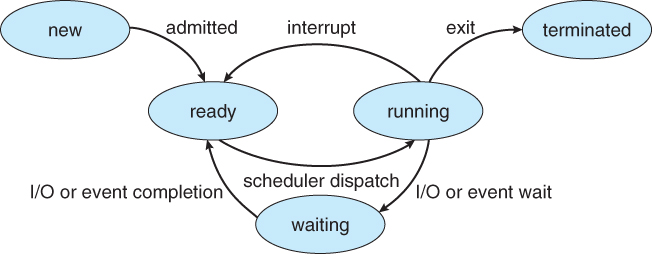

# 목차

1. **운영체제란?**
2. **프로세스 vs 스레드**
3. **프로세스 주소 공간**
4. **인터럽트(Interrupt)**
5. **시스템 콜(System Call)**
6. **PCB와 Context Switching**
7. **IPC(Inter Process Communication)**
8. **CPU 스케줄링**
9. 데드락(DeadLock)
10. Race Condition
11. 세마포어(Semaphore) & 뮤텍스(Mutex)
12. 페이징 & 세그먼테이션 (PDF)
13. 페이지 교체 알고리즘
14. 메모리(Memory)
15. 파일 시스템

---

# 운영체제란?

- 하드웨어를 관리하고, 응용 프로그램과 하드웨어 사이에 인터페이스 역할을 하며, 시스템 동작을 제어하는 시스템 소프트웨어
  - 프로세스 관리 : 스케쥴링, IPC 통신
  - 저장장치 관리 : 메모리 관리, 가상메모리, 파일 시스템
  - 네트워킹 : TCP/IP , 기타 프로토콜
  - 사용자 관리 : 계정관리 , 접근권한 관리
  - 디바이스 드라이버 : 순차접근, 임의접근, 네트워크 장치

# 프로세스 vs 스레드

- 프로세스는 메모리 상에서 실행중인 작업을 의미하고, 스레드는 프로세스 안에서 실행되는 여러 흐름의 단위를 말한다.
- 프로세스는 별도의 주소 공간(스택, 데이터, 코드, 힙)을 할당받지만 스레드는 지역변수, 매개변수 등 임시 메모리 영역인 **stack을 할당**받고 나머지 영역(code, data, heap)은 공유한다.
  - 스택을 독립적으로 할당하는 이유는 함수 호출시 전달되는 인자, 지역변수 등을 저장하기 위해서이며, 스택이 독립적이기 때문에 독립적인 함수 호출이 가능하다. 
  - PC를 스레드마다 독립적으로 할당하는 이유
    - 스레드는 cpu를 할당받았다가 다시 스켈줄러에 의해 선점당하기 때문에 명령어가 연속적으로 수행되지 못하고 어느 부분까지 수행했는지 기억할 필요가 있다. 

> 멀티 프로세스

* 하나의 컴퓨터에 여러 CPU 가 있어서 하나 이상의 프로세스를 동시에 처리한다. 메모리 침범 문제를 OS 차원에서 해결하지만 독립된 메모리 영역을 가지고 있어서 작업량이 많을 수록 오버헤드가 발생하고 context switching으로 성능이 저하됩니다.
* **context switching** - 프로세스의 상태의 정보를 저장하고 복원하는 과정 , 다음 프로세스로 넘어가기 이전에 프로세스 PCB정보를 **레지스터에 적재**한다.

> 멀티 스레드

- 하나의 프로세스 내에서 둘 이상의 스레드가 동시에 작업을 수행하는 것을 말한다. 공유 메모리를 사용하여 시간 자원 손실이 감소하고 전역변수와 정적 변수에 대한 자료 공유가 가능합니다. 하지만 동일 변수가 여러명이 접근시 동기화의 문제가 발생합니다. 이런 문제는 크리티컬 섹션 기법을 통해 대비할 수 있습니다.

  - 단점 : 
    - 단일 프로세스 시스템의 경우 효과 기대 어렵
    - 다른 프로세스에서 스레드를 제어할 수 없다
    - 하나의 스레드에 문제 발생시 전체 프로세스 영향
  
- 멀티프로세스보다 멀티스레드를 사용하는 이유

  - 프로세스를 생성하여 자원을 할당하는 시스템 콜이 감소
  - 시스템 처리량 증가 
    - 스레드 간 데이터를 주고 받는 것이 가능해져 자원 소모가 줄어든다.
    - 스레스 사이 작업량이 작아 context switching이 빠르다
  - 프로세스 통신보다 스레드간의 통신 부담 적음
    - stack 제외한 모든 메모리를 공유하기 때문에 통신 부담이 적다. 

> 멀티스레드 예시  : 게임
>
> 
>
> 추가 자료 : 
>
> ### 두 종류의 프로그래밍 스타일
>
> - Heterogeneous
>   - 작업을 쪼개서 종류별로 다른 쓰레드에게 맡기는 스타일 
> - Homogenous (event driven, data driven)
>   - 작업을 쪼개서 쓰레드 구분없이 나누어 하는 스타일
>
>  멀티스레드 프로그래밍 스타일은 2개다. 헤테로지니어스는 3d게임 엔진이라면, 랜더링파트, ai파트, 물리엔진파트, 사운드처리 파트, 이펙트처리 파트, 네트워크 모듈, 유저 input 모듈 등 다 따로 있으니 하나씩 쓰레드로 별도의 스레드로 동작시키자는 것이 이 헤테로지니어스 방식이다. 언리얼 엔진이 이 방식으로 구현된 게임 엔진이다. 로직스레드 렌더링스레드 사운드스레드 특수효과스레드 로딩스레드 물리엔진스레드 다 기능별로 구분되어있다. 왜 이렇게 했나? 싱글스레드로 프로그램 짰을때 멀티스레드로 바꾸는 건 어려운데, 헤테로지니어스는 그나마 난이도가 낮다. 다른 스레드간의 인터페이스, 메소드 호출만 잘 동기화 시키면 빠른시간안에 싱글스레드 프로그램을 멀티스레드 프로그램으로 바꿀수있다. 이렇게 바꾸는 경우에 많이 사용하는 방식이다. 근데 이 방식의 단점은?? 스레드마다 하는 일이 다르기 때문에 바틀넥 스레드가 있을 수 있다. 속도가 나오지 않으면 다같이 느려진다. 성능향상의 한계가 존재한다. 코어가 많을때 많은 코어를 100%활용하기도 어렵고. 처음부터 멀티스레드 구현하겠다 작정하면, 호모지니어스 방식을 많이 쓴다.
>
> 호모지니어스 방식은 다른 이름으로 이벤트드리븐이나 데이터드리븐으로 불리는데, 컴퓨터가 처리해야할 일들을 잘게 쪼개서 쭉 늘어놓고 그 쪼개진 일들을 순서대로 처리하는데 여러개의 스레드가 그냥 손에 잡히는대로 처리해준다. 이 작업은 물리엔진에 관련된 작업이니까 물리엔진 스레드가 해야한다. 이런게 없고, 자기가 할일이 없어지면 작업을 그냥 꺼낸다. 작업을 실행해야하는 순서대로 정렬한다음에 모든 스레드가 놀지않고 모든 작업을 순서대로 가져가서 풀로 사용하는 것이 호모지니어스 방식. 
>
> 
>
> 출처: https://popcorntree.tistory.com/84?category=813524 [어떤 프로그래머]

참고 자료 : [Process / Thread (tistory.com)](https://one10004.tistory.com/8)

# 프로세스 주소 공간

- 코드 : 프로세스가 실행할 코드와 매크로 상수가 기계어로 저장된 공간이다. 컴파일 타임에 결정되고 중간에 코드를 바꿀 수 없게 read-only로 되어있다.
- data : 전역변수, static 변수, 배열 저장 / 전역변수, static 값을 참조한 코드는 컴파일하고나면 data 영역의 주소값을 가르키도록 바뀐다. 실행중에도 전역변수가 변경될 수 있으니 이 영역은 read-write로 지정
- heap : 프로그래머들이 필요할 때마다 사용하는 메모리 영역이다. 동적할당시 사용 , 런타임이 결정되고 사용한 뒤에는 반드시 메모리 해제를 해야한다. 그렇지 않으면 메모리 누수가 발생한다. 
- stack : 지역변수, 매개변수, 리턴 값 등을 저장하고 종료되면 제거한다. 기록하고 종료하는 메커니즘은 후위선출 방식이다.

Q1. 코드와 데이터 세셕의 분리 이유? 

* 프로그램을 코드와 데이터 섹션으로 분리하는 가장 큰 이점 중 하나는 코드 섹션을 읽기 전용으로 만드는 반면 데이터 섹션은 쓰기 가능한 상태로 유지할 수 있다는 것입니다. 이렇게 하면 코드 섹션이 프로그램에 의해 실수로 수정되는 것을 방지하고 동일한 프로그램을 실행하는 프로세스 간에 공유할 수 있습니다.

Q2. 왜 스택과 data를 나누었나? 

* 일단 Stack이란 구조은 후입선출의 구조입니다. c언어를 예를들면, 함수의 호출은 stack의 구조입니다. 함수의 Stack 구조로 인해 Data 부분과 Stack 부분을 나눔. 전역 변수(global variables)는 어떤 함수에서도 접근 할 수 있기 때문에 Data로 따로 관리. 따라서 함수 외부(Outside function)와 함수(Inside function, 지역 변수 포함)에 따라서 Stack구조 활용을 위해 나눔

참고 자료 : [프로세스(Process)의 주소 공간(Address Space) (tistory.com)](https://whereisusb.tistory.com/10)

# 인터럽트(Interrupt)

- 프로그램을 실행하는 도중에 예기치 않은 상황이 발생할 경우, 현재 실행중인 작업을 즉시 중단하고 발생된 상황에 대해 CPU에게 알림
  - 외부 인터럽트 - 입출력장치, 타이밍 장치 등 외부적 요인으로 발생
  - 내부 인터럽트 - 잘못된 명령이나 데이터를 사용할 때 발생
  - 소프트웨어 인터럽트 - 프로그램 처리 중 명령에 의해 발생
- MCU 자체가 하드웨어적으로 변화를 체크하고 변화 시에만 일정한 동작을 하는 방식인 인터럽트 방식과 명령어를 사용해 입력 핀의 값을 계속 읽어 변화를 알아내는 폴링 방식이 있다. 폴링하는 시간에는 하던일을 집중할 수 없으므로 많은 기능을 제대로 수행하지 못한다.
- 인터럽트 방식은 하드웨어를 지원받아야하는 제약이 있지만 실시간 대응이 필요한 경우 필수적인 기능이다.
- 인터럽트 동작 순서 
  - 인터럽트 요청
  - 프로그램 실행 중단 : 현재 실행중인 micro operation까지 수행
  - 현재 프로그램 상태 보존 : PCB, PC
  - 인터럽트 처리루틴 실행 : 인터럽트 요청한 장치를 식별
  - 인터럽트 서비스 루틴 실행 : 
    - 인터럽트 원인 파악하고 실질적 작업 수행
    - 서비스 루틴 중 우선순위가 높은 인터럽트 발생시 재귀적으로 1-5 수행
    - 인터럽트 서비스 루틴을 실행할 때 인터럽트 플래그를 0으로 하면 인터럽트 발생 방지 할 수 있다.
  - 상태 복구 : 인터럽트 발생시 저장해둔 PC를 다시 복구
  - 중단된 프로그램 실행 : PCB 값을 이용해 이전에 수행중이던 프로그램 재개

참고 자료 : [인터럽트 - IT위키 (itwiki.kr)](https://itwiki.kr/w/인터럽트)

# 시스템 콜(System Call)

* 운영체제는 **커널 모드(Kernel Mode)**와 **사용자 모드(User Mode)**로 나뉘어 구동
* 운영체제에서 프로그램이 구동되는데 있어 파일을 읽어 오거나, 파일을 쓰거나, 혹은 화면에 메시지를 출력하는 등 많으 부분이 커널 모드를 사용
* 시스템 콜은 이러한 커널 영역의 기능을 사용자 모드가 사용 가능하게, 즉 프로세스가 하드웨어에 직접 접근해서 필요한 기능을 사용할 수 있게 해준다.

* 시스템 콜의 유형
  * 프로세스 제어 : 
  * 파일 조작 : 파일 생성, 삭제, 열기, 닫기, 쓰기 등등
  * 장치 관리 : 장치를 요구, 방출, 읽기, 쓰기 위치 변경, 장치 속성 설정 등
  * 정보 유지 : 시간과 날짜 설정과 획득, 시스템 데이터 설정과 획득 등
  * 통신 : 통신 연결 생성, 제거, 메세지 송수신, 상태 정보 전달 등

참고자료 : [운영체제 04 : 시스템 콜 (시스템 호출, System Call) (tistory.com)](https://luckyyowu.tistory.com/133)

# PCB와 Context Switching

- CPU가 프로세스가 여러 개일 때, CPU 스케줄링을 통해 관리하는 것을 말합니다. 이때, CPU는 각 프로세스들이 누군지 알아야 관리가 가능합니다. 이러한 프로세스들의 특징을 갖고 있는 것이 바로 **Process Metadata**입니다.
- Process Metadata의 정보
  - 프로세스 ID : PID라고 하며, 프로세스 고유 식별 번호
  - 프로세스 상태 : 프로세스의 현재 상태 (준비, 실행, 대기 상태)
  - 스케쥴링 정보 : 프로세스 우선순위 등 스케쥴링 정보 기억
  - CPU 레지스터 : 프로세스의 레지스터 상태를 저장하는 공간
  - 계정 정보 : CPU 사용시간의 정보, 각종 스케쥴러의 필요 정보를 기억
  - 기억 장치 관리 정보 : 프로그램이 적재될 기억 장치의 상한치, 하한치, 페이지 테이블 등의 정보를 기억
  - 입출력 정보 : 프로세스 수행시 필요한 주변장치, 파일 정보 기억
  - 프로그램 카운터 : 다음 실행되는 명령어의 주소 기억
- 이러한 정보를 담긴 메타데이터는 프로세스가 생명되면 **PCB(Process Control Block)**이라는 곳에 저장

* 프로그램 실행 > 프로세스 생성 > 프로세스 주소 공간에 (코드, 데이터, 스택) 생성 > 이 프로세스 메타 데이터를 PCB에 저장

> PCB 관리 방식

* 링크드 리스트 방식으로 관리
* PCB 리스트 헤더에 PCB들이 붙게 되어 주소값으로 연결됨. 삽입 삭제가 용이하다
* 프로세스 생성되면 해당 PCB가 생성되고 프로세스 완료시 제거된다.
* 수행중인 프로세스를 변경할 때, **CPU 레지스터 정보가 변경되는 것을 context switching**이라고 한다.

 

> context swicthing

* CPU가 현재 실행하고 있는 task 상태를 저장
* 다음 진행할 task의 상태 및 레지스터 값들에 대한 정보를 읽어 새로운 task context 정보로 교체하는 과정
* 인터럽트가 발생하거나, 실행 중인 CPU 사용 허가 시간을 모두 소모하거나, 입출력을 위해 대기해야 하는 경우 Context Switching이 발생
* Context Switching은 프로세스가 Ready -> Running , Running -> Ready , Running -> Block 처럼 상태 변경 시에 발생

참고 자료 : [[OS\] PCB와 Context Switching : 네이버 블로그 (naver.com)](https://m.blog.naver.com/adamdoha/222019884898)

# IPC(Inter Process Communication)

- 프로세스는 완전히 독립된 실행 객체이다. 이것은 다른 프로세스의 영향을 받지 않는다는 장점이 있지만, 독립된 만큼 별도의 설비 없이 서로 통신이 어렵다는 단점이 있다.
- 커널 영역에서 IPC라는 내부 프로세스간 통신이 가능하다. 

> 종류

- PIPE 
  - 동일한 PPID를 가진 프로세스간 통신 가능 (부모/자식 통신상대가 확실한 경우 사용)
  - 한 방향으로 통신하는 반이중 통신, 한쪽은 쓰고 한쪽은 읽을수만 있다.
  - 단순한 데이터 흐름을 가진다면 익명의 PIPE를 사용하면 된다. 
  - 반이중 통신이기 때문에 읽기와 쓰기 모두 해야한다면 파이프를 두개 만들어야하고 구현이 복잡해질 수 있다.
  
- Named PIPE(FIFO)
  - 부모 프로세스와 무관하게 전혀 다른 프로세스 사이에서도 통신이 가능하다.
  
  - Pipe name을 아는 모든 프로세스간의 통신이 가능하다.
  
  - Named 파이프도 반이중 통신.
  
  - 호스트 영역의 서버 클라이언트 간에 전이중 통신을 위해서는 결국 PIPE와 같이 두개의 FIFO파일이 필요
  
    > named pipe가 존재하는 방식 : 리눅스에서 모든 것은 파일로 통한다. named pipe도 파일로 존재한다. pipe 파일이 존재하고, 이 파일의 이름이 pipe name이다. 파일은 시스템 전역적으로 관리하는 객체이기 때문에 이름만 안다면 어떤 프로세스라도 접근 가능하다. 

- Message Queue
  - Queue(큐)는 선입선출의 자료구조를 가지는 통신설비로 커널에서 관리
  - 입출력 방식으로는 Named와 동일하지만 메시지 큐는 파이프 처럼 데이터의 흐름이 아니라 **메모리 공간**이다.
  - 컨테이너 벨트의 장점처럼 **사용할 데이터에 번호를 붙이면서** 여러 프로세스가 동시에 데이터를 쉽게 다룰 수 있다.
- 공유메모리
  - 데이터를 아예 공유하는 방법이다.
  - **Shared Memory**는 **공유메모리가 데이터 자체를 공유하도록** **지원**하는 설비
  - 프로세스는 자신만의 메모리 영역을 가지고 있다. 다른 프로세스가 접근하지 못하도록 커널에 의해 보호된다. (다른 프로세스가 메모리 영역을 침범할 경우 SIGSEGV 경고 시그널 발생)
  - 공유 메모리는 프로세스간 메모리 영역을 공유해서 사용할 수 있도록 허용한다. 
    - 프로세스가 메모리 할당을 커널에 요청하면 커널은 해당 프로세스에 메모리 공간을 할당
    - 공유메모리는 중개자 없이 곧바로 메모리 접근이 가능하기 때문에 IPC 중 가장 빠르게 작동할 수 있다. 
- 메모리 맵
  - 공유 메모리와 비슷하지만 차이점은 메모리 맵의 경우 **열린 파일을 메모리에 매핑시켜 공유**한다. 
  - 파일은 시스템의 전역적인 자원으므로 다른 프로세스끼리 데이터 공유해도 문제가 없을 것으로 예상할 수 있다.
- 소켓
  - Socket은 프로세스와 시스템의 기초적인 부분이며, 프로세스 들 사이의 통신을 가능하게 함
  - <sys/socket.h>라는 헤더를 이용하여 사용할 수 있으며, 같은 도메인에서의 경우에서 연결 될 수 있다.
  - 소켓을 사용하기 위해서는 생성해주고, 이름을 지정해야 한다.
  - 또한 domain과 type, Protocol을 지정해 주어야 합니다.
  - 서버 단에서는 bind, listen, accept를 해주어 소켓 연결을 위한 준비를 해주어야 하고 , 클라이언트 단에서는 connect를 통해 서버에 요청하며, 연결이 수립 된 이후에는 Socket을 send함으로써 데이터를 주고 받게 됩니다. 연결이 끝난 후에는 반드시 Socket 을 close()

참고 자료 : [개발자를 꿈꾸는 프로그래머 :: IPC의 종류와 특징 (tistory.com)](https://jwprogramming.tistory.com/54)

# CPU 스케줄링

- CPU를 잘 사용하기 위해 프로세스를 배정

- 목표

  - batch system : 가능한 많은 일 수행, 시간보다 처리량 중요

  - interactive system : 빠른 응답시간, 적은 대기 시간

  - real time system : 기한 맞추기

  - 

  - 

    

- Admitted (승인) : 프로세스 생성이 가능하여 승인됨
- Scheduler Dispatch (스케쥴러 디스패치) : 준비 상태에 있는 프로세스 하나를 선택하여 실행시킨다.
- Interrupt (인터럽트) : 예외, 입출력, 이벤트 등이 발생하여 현재 실행 중인 프로세스를 준비상태로 바꾸고, 해당 작업을 먼저 처리한다.
- I.O or event wait (입출력 또는 이벤트 대기) : 실행 중인 프로세스가 입출력이거나 이벤트를 처리해야하는 경우, 입출력이 모두 끝날 때까지 대기 상태로 만든다.
- I/O or Event Completion (입출력 또는 이벤트 완료) : 입출력 / 이벤트가 끝난 프로세스를 준비 상태로 전환하여 스케쥴러에 의해 선택 될 수 있도록 한다.

> CPU 스케쥴러

* *스케줄링 대상은 Ready Queue 에 있는 프로세스들이다.*

#### **비선점 스케쥴링(Non-Preemptive)**

- FCFS(First Come First Served)
  - 특징
    - 먼저 온 고객을 먼저 서비스해주는 방식, 즉 먼저 온 순서대로 처리.
    - 일단 CPU 를 잡으면 CPU burst 가 완료될 때까지 CPU 를 반환하지 않는다. 할당되었던 CPU 가 반환될 때만 스케줄링이 이루어진다.
  - 문제점
    - convoy effect 소요시간이 긴 프로세스가 먼저 도달하면 효율성을 낮추는 현상이 발생한다.
- SJF(Shortest - Job - First)
  - 특징
    - 다른 프로세스가 먼저 도착했어도 CPU burst time 이 짧은 프로세스에게 선 할당
  - 문제점
    - starvation(기아상태) 효율성을 추구하는게 가장 중요하지만 특정 프로세스가 지나치게 차별받으면 안되는 것이다. 이 스케줄링은 극단적으로 CPU 사용이 짧은 job 을 선호한다. 그래서 사용 시간이 긴 프로세스는 거의 영원히 CPU 를 할당받을 수 없다.
- HRN(Highest Response-ratio Next)
  - 우선순위를 계산하여 점유불평등을 보완한 방법(SJF 단점 보완)
  - 우선순위 = ( 대기시간 + 실행시간 ) / 실행시간

#### 선점 스케쥴링(Preemptive)

- SRT(Shortest Remaining time First)
  - 특징
    - 새로운 프로세스가 도착할 때마다 새로운 스케줄링이 이루어진다.
    - 선점형 (Preemptive) 스케줄링현 재 수행중인 프로세스의 남은 burst time 보다 **더 짧은 CPU burst time 을 가지는 새로운 프로세스가 도착하면 CPU 를 뺏긴다**.
  - 문제점
    - starvation
    - 새로운 프로세스가 도달할 때마다 스케줄링을 다시하기 때문에 CPU burst time(CPU 사용시간)을 측정할 수가 없다.
- Priority Scheduling
  - 특징
    - 우선순위가 가장 높은 프로세스에게 CPU 를 할당하는 스케줄링이다. 우선순위란 정수로 표현하게 되고 작은 숫자가 우선순위가 높다.
    - 선점형 스케줄링(Preemptive) 방식 - 더 높은 우선순위의 프로세스가 도착하면 실행중인 프로세스를 멈추고 CPU 를 선점한다.
    - 비선점형 스케줄링(Non-Preemptive) 방식 - 더 높은 우선순위의 프로세스가 도착하면 Ready Queue 의 Head 에 넣는다.
  - 문제점
    - starvation
    - 무기한 봉쇄(Indefinite blocking)실행 준비는 되어있으나 CPU 를 사용못하는 프로세스를 CPU 가 무기한 대기하는 상태
  - 해결책
    - aging 아무리 우선순위가 낮은 프로세스라도 오래 기다리면 우선순위를 높여주자.
- Round Robin
  - 특징
    - 현대적인 CPU 스케줄링
    - 각 프로세스는 동일한 크기의 할당 시간(time quantum)을 갖게 된다.
    - 할당 시간이 지나면 프로세스는 선점당하고 ready queue 의 제일 뒤에 가서 다시 줄을 선다.
    - `RR`은 CPU 사용시간이 랜덤한 프로세스들이 섞여있을 경우에 효율적
    - `RR`이 가능한 이유는 프로세스의 context 를 save 할 수 있기 때문이다.
  - 장점
    - `Response time`이 빨라진다. n 개의 프로세스가 ready queue 에 있고 할당시간이 q(time quantum)인 경우 각 프로세스는 q 단위로 CPU 시간의 1/n 을 얻는다. 즉, 어떤 프로세스도 (n-1)q time unit 이상 기다리지 않는다.
  - 프로세스가 기다리는 시간이 CPU 를 사용할 만큼 증가한다.공정한 스케줄링이라고 할 수 있다.
  - 주의할 점
    - 설정한 `time quantum`이 너무 커지면 `FCFS`와 같아진다. 또 너무 작아지면 스케줄링 알고리즘의 목적에는 이상적이지만 잦은 context switch 로 overhead 가 발생한다. 그렇기 때문에 적당한 `time quantum`을 설정하는 것이 중요하다.
- Multilevel-Queue (다단계 큐)
  - 우선순위가 낮은 큐들이 실행 못하는 걸 방지하고자 각 큐마다 다른 `time quantum`을 설정
  - 우선순위가 높은 큐는 작은 `time quantum` 할당
  - 우선순위가 낮은 큐는 큰 `time quantum` 할당
- Multilevel-Feedback-Queue (다단계 피드백 큐)
  - 모든 프로세스들은 일단 제일 위에 있는 큐로 들어간다.
  - 제일 위에 있는 queue는 RR로 스케쥴링을 한다. 만약 time quantum을 채우지 못한 프로세스는 냅두고, time quantum을 채운 프로세스는 그 밑에 레벨의 큐로 들어간다. 밑의 프로세스는 타임 퀀덤이 크기가 두배이다.
  - 예를들어, 엄청 큰 게임을 다운한다고 할 때, CPU burst가 큰 프로세스를 우선순위가 낮다고 판별하는 것
  - 이것은 고전적인 방법 → 실제로는 솔라리스 2.6 스케쥴러 사용
  - 문제점
    - 우선순위가 높은 프로세스가 들어오면 그것만 계속 실행됨. 낮은 순위는 starvation 문제가 발생한다.
  - 해결방안
    - aging 방식 도입

#### CPU 스케쥴링 척도

1. Response Time
   - 작업이 처음 실행되기까지 걸린 시간
2. Turnaround Time
   - **실행 시간과 대기 시간을 모두 합한 시간**으로 작업이 완료될 때 까지 걸린 시간

