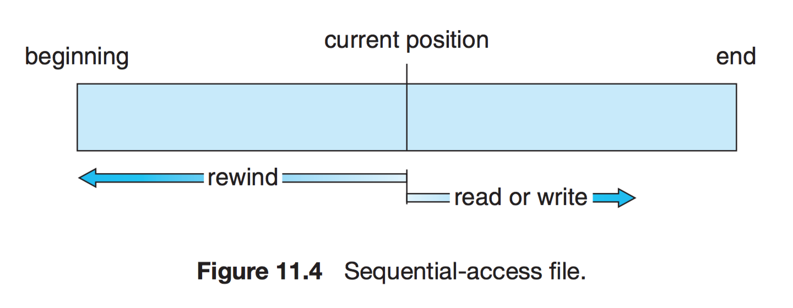

## CPU 스케줄링

### 핵심개념
- cpu 스케줄링(정의, 목표), cpu 스케줄링의 종류, 스케줄링 기법의 종류/내용/보완책/구분

### 0. 정의
cpu 스케줄링이란 cpu스케줄러가 어떤 프로세스에 CPU를 배정할지 결정하는 작업을 의미한다.
- 조건 : 오버헤드 ↓ / 사용률 ↑ / 기아 현상 ↓
- 목표
    1. Batch System: 가능하면 많은 일을 수행. 시간(time) 보단 처리량(throughout)이 중요
    2. Interactive System: 빠른 응답 시간. 적은 대기 시간.
    3. Real-time System: 기한(deadline) 맞추기.

**CPU 스케줄링의 종류**
- 장기 (Long-term scheduling)
    - 어떤 프로세스가 시스템의 자원을 차지할 수 있도록 할 것인가를 결정하여 아래 준비(ready) 상태 큐로 보내는 작업을 의미한다.
    - 상위 스케줄링이라고도 하며, 작업 스케줄러에 의해 수행된다.
    - 수행 빈도 적고, 느리다.

- 중기 (middle-term scheduling)
    - 어떤 프로세스들이 CPU를 할당 받을 것인지 결정하는 작업을 의미한다.
    - CPU를 할당받으려는 프로세스가 많을 경우 프로세스를 일시 대기(waiting)시킨 후 활성화해서 일시적으로 부하를 조절한다.
    - 스왑 인/아웃 결정 (메모리 부족 시 swap out, 남으면 swap in) 한다.

- 단기 (Short-term scheduling)
    - 프로세스가 실행되기 위해 CPU를 할당받는 시기와 특정 프로세스를 지정하는 작업을 의미한다.
    - 프로세서 스케줄링, 하위 스케줄링이라고도 한다.
    - 프로세서 스케줄링 및 문맥 교환은 프로세서 스케줄러에 의해 수행한다.
    - 자주 수행되고 빠르다.


### 1. CPU 스케줄링 기법의 종류.
CPU스케줄링 기법은 보통 선점 스케줄링과, 비선점 스케줄링으로 나누어 설명합니다.

### 선점/ 비선점 스케줄링
- 선점: 시분할 시스템에서 타임 슬라이스가 소진되었거나, 인터럽트나 시스템 호출 종료 시에 더 높은 우선 순위 프로세스가 발생 되었음을 알았을 때, 현 실행 프로세스로부터 강제로 CPU를 회수하는 것
-> 우선순위가 높으면 CPU를 중간에 뺏어서 할당받을 수 있음.

- 비선점: 프로세스가 자원을 할당 받았을 경우, 자원을 스스로 반납할 때까지 계속 그 자원을 사용하도록 허용하는 정책
-> 문제가 생기지 않는 이상 작업 종료 전까지 CPU 사용 가능.
 
**비선점 스케줄링**
- FCFS : 큐에 도착한 순서대로 CPU 할당
- SJF : 수행시간이 짧은 것 부터 CPU 할당
- HRN : 우선순위 = (대기시간 + 실행시간)/(실행시간)으로 계산해서 우선순위 책정 및 CPU 할당.

**선점 스케줄링**
- 우선순위 스케줄링 : 우선순위가 높은 순서대로 처리, 아래의 스케줄링 방식은 모두 일종의 우선순위 스케줄링이다.
- Round Robin : 동일한 시간의 time quantum만큼 할당받아 그 시간만큼 수행.
- Multilevel Queue : 작업을 여러 종류의 큐로 나누어 큐마다 다른 time quantum 할당
- Multilevel-feedback Queue : Multilevel에서 time quantum을 채우면 다음 level로 내려감, **현대 운영체제에서 주로 채택**됨.

- 다른 스케줄링 기법들은 간단하기 때문에 Multilevel Queue와 Multilevel-feedback Queue만 제대로 이해하면 될 듯.

**Multilevel Queue**

- 우선순위가 다른 여러 큐를 두고 작업을 관리한다.
- 우선순위가 낮은 경우 계속 해서 실행되지 못할 수 있다.(기아상태)

**Multilevel-feedback Queue**

- 멀티레벨큐를 보완.
- CPU burst가 낮은 작업을 우선적으로 처리 ->  사용자와 상호작용이 낮기 때문!
- 우선순위 높은 작업이 계속 들어올 경우 기아현상 발생 -> Aging을 적용하는식으로 해결.

### 2. 기아상태
- 프로세스가 끊임없이 필요한 컴퓨터 자원을 가져오지 못하는 상황

#### 해결 방안
 - 우선순위 변경 : 프로세스 우선순위를 수시로 변경해서, 각 프로세스가 높은 우선순위를 가질 기회주기
 - Aging: 오래 기다린 프로세스의 우선순위를 높여주기
 - 우선순위가 아닌, 요청 순서대로 처리하는 FIFO 기반 요청큐 사용

## 데드락(교착상태)

### 핵심개념
- 교착상태, 발생 조건, 해결책, 실제예시

### 0. 교착상태?
교착 상태란 두 개 이상의 작업이 서로 상대방의 작업이 끝나기만을 기다리고 있기 때문에 결과적으로 아무것도 완료되지 못하는 상태를 말합니다.

### 1. 교착상태 발생조건

교착 상태(데드락)은 비선점, 환형대기, 점유와대기,  상호배제의 조건이 모두 충족될 경우에 발생합니다.

1. **상호 배제(Mutual exclusion)**
자원은 한번에 한 프로세스만 사용할 수 있음

2. **점유 대기(Hold and wait)**
최소한 하나의 자원을 점유하고 있으면서 다른 프로세스에 할당되어 사용하고 있는 자원을 추가로 점유하기 위해 대기하는 프로세스가 존재해야 함

3. **비선점(No preemption)**
다른 프로세스에 할당된 자원은 사용이 끝날 때까지 강제로 빼앗을 수 없음

4. **순환 대기(Circular wait)**
프로세스의 집합에서 순환 형태로 자원을 대기하고 있어야 함


### 2. 교착상태 해결책

1. **예방(prevention)**
    
    교착 상태 발생 조건 중 하나를 제거하면서 해결한다 (자원 낭비 엄청 심함)
    
    - 상호배제 부정 : 여러 프로세스가 공유 자원 사용
    - 점유대기 부정 : 프로세스 실행전 모든 자원을 할당
    - 비선점 부정 : 자원 점유 중인 프로세스가 다른 자원을 요구할 때 가진 자원 반납
    - 순환대기 부정 : 자원에 고유번호 할당 후 순서대로 자원 요구

2. **회피(avoidance) -** 교착 상태 발생 시 피해나가는 방법
    
    **은행원 알고리즘(Banker's Algorithm)**
    
    은행에서 모든 고객의 요구가 충족되도록 현금을 할당하는데서 유래함
    
    프로세스가 자원을 요구할 때, 시스템은 자원을 할당한 후에도 안정 상태로 남아있으면 자원할당, 아니면 할당을 거부하고 다른 프로세스 들이 자원을 해지할때까지 대기하는 방법
    
3. **탐지(Detection) & 회복**
    
    - 은행원 알고리즘과 유사한 방식 vs 자원 할당 그래프를 통해 교착 상태를 탐지함
    
    - 자원 요청 시, 탐지 알고리즘을 실행시켜 그에 대한 오버헤드 발생함
    
    - 타임아웃을 이용한 교착상태의 검출 : 현대 운영체제와 DB에서 사용되는 방법

4. **회복(Recovery) -** 교착 상태 일으킨 프로세스를 종료하거나, 할당된 자원을 해제시켜 회복시키는 방법
    
    **프로세스 종료 방법**
    
    - 교착 상태의 프로세스를 모두 중지
    - 교착 상태가 제거될 때까지 하나씩 프로세스 중지
    
    **자원 선점 방법**
    
    - 교착 상태의 프로세스가 점유하고 있는 자원을 선점해 다른 프로세스에게 할당 (해당 프로세스 일시정지 시킴)
    - 우선 순위가 낮은 프로세스나 수행 횟수 적은 프로세스 위주로 프로세스 자원 선점

5. **무시**

### 3. 현대 운영체제
- 교착상태가 자주 일어나는 상황이 아니기 때문에, 현대 운영체제에서는 대부분 교착상태가 발생할 경우에, 사용자 스스로 처리할 수 있도록 에러를 띄우는 교착상태 무시 방법을 사용합니다.
- 또는 타임아웃을 이용한 교착상태의 검출을 통해 사용자에게 알려줍니다. ex) 윈도우에서 회색으로 화면이 멈추는 경우?

## Race Condition

경쟁상태는 **동시성 문제**와 관련되어 있습니다.

### 0. 정의
```
두 개 이상의 프로세스가 공통 자원을 병행적으로(concurrently) 읽거나 쓰는 동작을 할 때, 공용 데이터에 대한 접근이 어떤 순서에 따라 이루어졌는지에 따라 그 실행 결과가  달라지는 상황 -> 해결을 위해 세마포어, 뮤텍스 도입, DB에서 락을 거는 이유, 트랜잭션 격리 수준을 설정하는 이유.
```

### 1. Race Condition이 발생하는 경우

1. 커널 작업을 수행하는 중에 인터럽트 발생
    - 문제점 : 커널모드에서 데이터를 로드하여 작업을 수행하다가 인터럽트가 발생하여 같은 데이터를 조작하는 경우
    - 해결법 : 커널모드에서 작업을 수행하는 동안, 인터럽트를 disable 시켜 CPU 제어권을 가져가지 못하도록 한다.

2. 프로세스가 'System Call'을 하여 커널 모드로 진입하여 작업을 수행하는 도중 문맥 교환이 발생할 때
    - 문제점 : 프로세스1이 커널모드에서 데이터를 조작하는 도중, 시간이 초과되어 CPU 제어권이 프로세스2로 넘어가 같은 데이터를 조작하는 경우 ( 프로세스2가 작업에 반영되지 않음 )
    - 해결법 : 프로세스가 커널모드에서 작업을 하는 경우 시간이 초과되어도 CPU 제어권이 다른 프로세스에게 넘어가지 않도록 함

3. 멀티 프로세서 환경에서 공유 메모리 내의 커널 데이터에 접근할 때
    - 문제점 : 멀티 프로세서 환경에서 2개의 CPU가 동시에 커널 내부의 공유 데이터에 접근하여 조작하는 경우
    - 해결법 : 커널 내부에 있는 각 공유 데이터에 접근할 때마다, 그 데이터에 대한 lock/unlock을 하는 방법


## 세마포어(Semaphore) & 뮤텍스(Mutex)

### 임계영역
- 병렬컴퓨팅에서 둘 이상의 스레드가 동시에 접근해서는 안되는 **공유 자원(자료 구조 또는 장치)을 접근하는 코드**의 일부
- 스레드가 공유자원의 배타적인 사용을 보장받기 위해서 임계 구역에 들어가거나 나올때는 세마포어 같은 동기화 매커니즘이 사용
- 소프트웨어적인 해결 방법(뮤텍스, 세마포어, 뮤텍스), 하드웨어적인 해결 방법(원자적 연산)이 있다.

### 임계영역 해결 조건
- 상호 배제, 한정 대기, 진행의 융통성 3가지 조건을 만족해야한다
- 상호 배제 : 한 프로세스가 임계구역에 들어가면, 다른 프로세스는 임계구역에 들어갈 수 없다.
- 한정 대기 : 특정 프로세스가 임계구역에 진입하지 못하면 안된다.
- 진행의 융통성 : 한 프로세스가 다른 프로세스의 진행을 방해해서는 안된다.

### 세마포어와 뮤텍스
- **공유된 자원**에 여러 프로세스가 동시에 접근하면서 문제가 발생할 수 있다. 이때 공유된 자원의 데이터는 한 번에 하나의 프로세스만 접근할 수 있도록 제한을 둬야 한다.
- 세마포어와 뮤텍스는 모두 동기화 문제를 해결하기 위한 방법입니다.

### 뮤텍스

```
뮤텍스는 한 프로세스의 내부에서 여러 스레드의 임계구역 제어를 위해 사용하는 객체
```
- 쉽게 말하자면, 열쇠가 있어야 들어갈 수 있는 화장실을 생각하면 된다.(화장실-공유자원, 열쇠-뮤텍스(lock))
- lock: 임계 구역에 들어갈 권한을 얻어온다. 사용 중이라면 대기한다.
- unlock: 현재 임계 구역을 모두 사용했음을 알린다. 다른 프로세스가 진입 가능해진다.

### 세마포어
```
두 개의 원자적 함수로 조작되는 정수 변수로서, 멀티프로그래밍 환경에서 공유 자원에 대한 접근을 제한하는 방법으로 사용
```
- 세마포어 S는 정수값을 가지는 변수이며, 다음과 같이 P와 V라는 명령에 의해서만 접근할 수 있다
- 세마포어 자체는 P,V 연산에 의해서만 접근 될 수 있는 **정수 값 S**를 의미한다.
- P연산: S가 0이면 기다리고, 아니면 S를 감소시키고 자원을 할당받는다.
- V연산: 자원 사용을 마치면 V연산 수행. S를 증가 시키고 자원을 반환한다.
```c++
 P(S) {
     S--;
     if S < 0
         // 이 프로세스를 재움 큐에 추가 (잠 듦)
 }

 V(S) {
     S++;
     if S <= 0
         // 재움 큐로부터 프로세스를 제거 (깨어남)
 }
```

### 세마포어와 뮤텍스 비교
- 세마포어(Semaphore) : 공유된 자원의 데이터를 여러 프로세스가 접근하는 것을 막는 것
- 뮤텍스(Mutex) : 공유된 자원의 데이터를 여러 쓰레드가 접근하는 것을 막는 것
- 뮤텍스와 세마포어는 튜링동치라고 한다 (서로를 통해 서로를 구현할 수 있다)

- 참고
https://worthpreading.tistory.com/90

## 메모리(Memory)

### 메모리 계층 구조


- 메모리를 필요에 따라 여러가지 종류로 나누어 둠
- CPU가 메모리에 더 빨리 접근하기 위한 목적
- CPU에 가까울수록 속도가 빠르고, 단위당 가격이 비싸다.

### 메인 메모리(RAM)
```
메인 메모리는 CPU가 직접 접근할 수 있는 기억 장치
프로세스가 실행되려면 프로그램이 메모리에 올라와야 함
```

### MMU(메모리 관리 장치)
```
 CPU가 메모리에 접근하는 것을 관리하는 컴퓨터 하드웨어 부품
 필요한 데이터가 없으면 해당 데이터를 메모리에 접근하여 가져온다.
```

**MMU 역할**
- 가져오기, 배치 ,재배치
    - 가져오기: 데이터를 언제 메모리에 가져올 것인가
    - 배치 : 메모리의 어떤 위치에 놓을 것인가
    - 재배치: 공간이 없을 때, 어떤 프로세스를 내보낼 것인가(페이지 교체 알고리즘)
- 주소변환: 가상메모리 주소를 실제 메모리 주소로 변환
- 메모리 보호: 운영체제 영역이나 다른 메모리에 접근 못하도록 막음
- 캐시관리
- 가상메모리를 통해 메모리 과할당을 수행한다.

* 물리주소(physical address): 컴퓨터의 메인 메모리를 접근할 때 사용되는 주소
*  논리 주소(logical address): 메모리 셀, 스토리지 요소, 네트워크 호스트와 같은 요소가 실행 중인 응용 프로그램의 관점에서 상주하고 있는 것처럼 보이는 주소

### 캐시 메모리
주기억장치에 저장된 내용의 일부를 임시로 저장해두는 기억장치
CPU와 주기억장치의 속도 차이로 성능 저하를 방지하기 위한 방법

### 가상 메모리
가상 메모리는 물리 메모리의 크기와 관계없이 메모리를 사용할 수 있도록 지원하는 기술이다.

현대 메모리 관리에서는 이러한 가상 메모리를 통해 물리 메모리의 크기와 프로세스가 올라갈 메모리의 위치를 신경쓰지않고 프로그래밍하도록 지원한다.

장점: 물리적 메모리에 제약을 받지 않는다. 병행성 및 cpu 이용률이 올라간다

단점: 전반적인 속도 저하가 있다.

### 지역성 (Locality) 에 대하여

```
지역성이란, 프로세스가 메모리를 참조할 때, 이리저리 균일하게 참조하는 것이 아니라 한 순간에 물리적으로 메모리의 한 부분을 집중적으로 참조하는 성질이다.
```

### 지역성의 종류
- 시간적 지역성
    - 최근에 참조된 메모리 주소가, 조만간 또 참조될 가능성이 높다는 것 (LRU 등)

- 공간적 지역성
    - 최근에 참조된 메모리 근처 (실제 물리적으로 근접) 에서 또 참조될 가능성이 높다는 것(배열 등)

- 순차 지역성
    - 데이터가 순차적으로 액세스되는 경향 (공간 지역성의 일부로 설명되기도 함)

## 페이징 & 세그먼테이션

### 주요개념
    - 물리메모리, 가상메모리, 페이징, 세그먼테이션

### 0. 메모리 관리 기법

1. 연속 메모리 관리(물리)
프로그램 전체가 하나의 커다란 공간에 연속적으로 할당되어야 함

- 고정 분할 기법
    - 주기억장치가 고정된 파티션으로 분할 (내부 단편화 발생)
    - 메모리 관리가 쉬움
- 가변 분할 기법
    - 파티션들이 동적 생성되며 자신의 크기와 같은 파티션에 적재 (외부 단편화 발생)
    - 프로세스를 한 덩어리로 처리하여, 하나의 프로세스를 연속된 공간에 배치

2. 불연속 메모리 관리(가상)
프로그램의 일부가 서로 다른 주소 공간에 할당될 수 있는 기법

- 페이지 : 고정 사이즈의 작은 프로세스 조각
- 프레임 : 페이지 크기와 같은 주기억장치 메모리 조각
- 세그먼트 : 서로 다른 크기를 가진 논리적 블록이 연속적 공간에 배치되는 것


### 1. 페이징과 세그멘테이션

- 가상 메모리 페이징
    - 필요한 페이지가 있으면 나중에 자동으로 불러들어짐
    - 외부 단편화 X
    - 복잡한 메모리 관리로 오버헤드 발생


- 가상 메모리 세그먼테이션
    - 필요하지 않은 세그먼트들은 로드되지 않음
    - 필요한 세그먼트 있을때 나중에 자동으로 불러들어짐
    - 내부 단편화X
    - 복잡한 메모리 관리로 오버헤드 발생

- 세그먼테이션&페이징 혼용기법
    - 사용자 입장에서는 세그멘테이션 기법
    - 관리자 입장에서는 페이징 기법을 상사용한다.
    - 세그먼테이션 테이블 : 권한 비트 & 페이지 테이블의 시작번호
    - 페이지 테이블 : 프레임 번호 저장
    - **현대의 운영체제에서 채택**한 메모리 관리 기법!


## 페이지 교체 알고리즘

### 주요개념
- 페이지 부재, LRU 알고리즘

### 0. 페이지 교체 알고리즘이란
페이지 부재 발생 → 새로운 페이지를 할당해야 함 → 현재 할당된 페이지 중 어떤 것 교체할 지 결정하는 방법이다.

- 페이지 부재가 발생하는 이유?
    - 요구 페이징을 통해 필요할 때 데이터를 메모리에 가져오기 때문에 페이지 부재가 발생한다.!

* 페이지 부재 : 프로세스가 페이지를 요청했을 때 그 페이지가 메모리에 없는 상황
* 요구 페이징 : 프로세스가 요청할 때 데이터를 메모리에 가져오는 것

### 1. 페이지 교체 알고리즘 종류
- FIFO 알고리즘: 제일 먼저 들어간 것 먼저 나오게
- **LRU 알고리즘** : 최근에 가장 적게 사용된 페이지를 나오게
- OPT 알고리즘 : 앞으로 가장 사용하지 않을 페이지 교체(구현 불가능 ~ 은행가 알고리즘?)
- LFU - Least Frequently Used : 참조 횟수가 가장 작은 페이지 교체
- MFU - Most Frequently used : 참조 횟수가 가장 많은 페이지 교체
- NUR - Not Used Recently : 최근에 사용하지 않은 페이지 교체

### 2. LRU 알고리즘


- 가정: 가장 오랫동안 사용하지 않았던 데이터라면 앞으로도 사용할 확률이 적을 것이다.
- 시간 지역성(temporal locality)성질 고려함.(최근에 참조된 페이지가 가까운 미래에 다시 참조될 가능성이 높은 성질)
- 사용된 시간을 알수있는 부분을 저장하여 가장 오랫동안 참조되지 않는 데이터를 제거
- 큐로 구현가능. 사용한 데이터를 큐에서 제거하여 맨 위로다시 올리고, 프레임이 모자랄 경우 맨 아래에 있는 데이터를 삭제
- 최적 알고리즘의 방식과 비슷한 효과를 낼 수 있는 방법
- 단점: 프로세스가 주기억장치에 접근할때마다 참조된 페이지 시간을 기록해야 하므로 막대한 오버헤드가 발생
- 카운터나 큐, 스택과 같은 별도의 하드웨어가 필요

- 거의 LRU 기법을 물어보는 것 같음. (캐시할당 기법에도 동일하게 LRU 기법이 사용된다.)
[https://doh-an.tistory.com/28](https://doh-an.tistory.com/28)


## 파일 시스템

### 파일
 컴퓨터 등의 기기에서 의미 있는 정보를 담는 논리적인 단위

### 파일 시스템
컴퓨터에서 파일이나 자료를 쉽게 발견할 수 있도록, 유지 및 관리하는 방법이다.
저장매체에는 수많은 파일이 있기 때문에, 이런 파일들을 관리하는 방법을 말한다

### 특징
- 커널 영역에서 동작
- 파일 CRUD 기능을 원활히 수행하기 위한 목적
- 계층적 디렉터리 구조를 가짐
- 디스크 파티션 별로 하나씩 둘 수 있음


### 역할
- 파일 관리
- 보조 저장소 관리
- 파일 무결성 메커니즘
- 접근 방법 제공

### 개발 목적
- 하드디스크와 메인 메모리 속도차를 줄이기 위함
- 파일 관리
- 하드디스크 용량 효율적 이용

### 구조
- 메타 영역 : 데이터 영역에 기록된 파일의 이름, 위치, 크기, 시간정보, 삭제유무 등의 파일 정보
- 데이터 영역 : 파일의 데이터

### 접근 방법
- 순차 접근(Sequential Access)
    - 가장 간단한 접근 방법으로, 대부분 연산은 read와 write
    - 현재 위치를 가리키는 포인터에서 시스템 콜이 발생할 경우 포인터를 앞으로 보내면서 read와 write를 진행.
    - 뒤로 돌아갈 땐 지정한 offset만큼 되감기를 해야 한다. (테이프 모델 기반)


- 직접 접근(Direct Access)
    - 특별한 순서없이, 빠르게 레코드를 read, write 가능
    - 현재 위치를 가리키는 cp 변수만 유지하면 직접 접근 파일을 가지고 순차 파일 기능을 쉽게 구현이 가능하다.
    - 무작위 파일 블록에 대한 임의 접근을 허용한다. 따라서 순서의 제약이 없음
    - 대규모 정보를 접근할 때 유용하기 때문에 '데이터베이스'에 활용된다.


- 기타 접근
    - 직접 접근 파일에 기반하여 색인 구축
    - 크기가 큰 파일을 입출력 탐색할 수 있게 도와주는 방법임


### 디렉터리와 디스크 구조
- 1단계 디렉터리
    - 가장 간단한 구조
    - 파일들은 서로 유일한 이름을 가짐. 서로 다른 사용자라도 같은 이름 사용 불가


- 2단계 디렉터리
    - 사용자에게 개별적인 디렉터리 만들어줌
    - UFD : 자신만의 사용자 파일 디렉터리
    - MFD : 사용자의 이름과 계정번호로 색인되어 있는 디렉터리


- 트리 구조 디렉터리
    - 2단계 구조 확장된 다단계 트리 구조
    - 한 비트를 활용하여, 일반 파일(0)인지 디렉터리 파일(1) 구분

- 그래프 구조 디렉터리
    - 순환이 발생하지 않도록 하위 디렉터리가 아닌 파일에 대한 링크만 허용하거나, 가비지 컬렉션을 이용해 전체 파일 시스템을 순회하고 접근 가능한 모든 것을 표시
    - 링크가 있으면 우회하여 순환을 피할 수 있음

